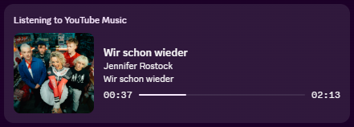

# YouTube Music Web Controller (`ytm-web-controller`)

[](https://opensource.org/licenses/MIT)
[](https://www.elgato.com/stream-deck)
[](https://developer.chrome.com/docs/extensions/mv3/intro/)

An ultra-lightweight, event-driven, resource-efficient open-source controller bridge connecting the official [YouTube Music Web App](https://music.youtube.com) directly to your **Elgato Stream Deck** (including **Stream Deck + Dials & LCD Touchstrips**).

---

## 📸 Screenshots & Preview

<p align="center">
  
  <br>
  <em>Stream Deck Plugin Action Setup & Dynamic Controls</em>
</p>

<p align="center">
  
  <br>
  <em>Discord Rich Presence Integration with Live Progress & Interactive Buttons</em>
</p>

---

## 🌟 Why This Exists

Most existing YouTube Music desktop solutions rely on heavy, outdated 3rd-party Electron wrappers (such as YouTube Music Desktop App / YTMD) that consume hundreds of megabytes of RAM and run unnecessary background processes.

**YouTube Music Web Controller** takes a modern, native approach:
- 🚀 **Use the Official Web Player or PWA**: Enjoy YouTube Music directly in Chrome, Brave, Edge, or Firefox with full official features, latest UI updates, and GPU acceleration.
- ⚡ **Zero Polling (`setInterval() == 0`)**: 100% event-driven architecture using native HTML5 `<video>` events and DOM MutationObservers. The connection remains completely silent and idle when music is paused.
- 🧠 **Zero-Disk Footprint**: Album artwork and dynamic LCD touchstrip graphics are computed and transferred strictly in-memory (RAM) via Base64 Data URLs. No temporary image cache is ever written to your disk.
- 🎮 **Stream Deck + Dial Support**: Rotary encoder track skipping with push-jitter protection, dial push & LCD tap Play/Pause toggle, dynamic marquee title scrolling, remaining time, and real-time LCD progress bars.
- 🎨 **100% Native Vector SVGs**: Crisp, official Google YouTube Music vector icons that scale perfectly to any Stream Deck key resolution.

---

## 📋 Feature Matrix

| Action | Type | Description |
| :--- | :--- | :--- |
| **Play / Pause** | Dual-State Key | Toggles playback. Optionally renders the live **Album Cover Art as the button background** in RAM or official vector Play/Pause states. |
| **YTM Dial Controller** | Stream Deck + Dial & LCD | Rotary control for **Track Skipping** (Clockwise: Next / Counter-Clockwise: Previous) with push-jitter suppression. LCD touchstrip displays album thumbnail, auto-scrolling marquee song title & artist, live time/remaining, and progress bar. Tap dial or touchstrip to toggle Play/Pause. |
| **Next Track** | Key | Skips to the next track. |
| **Previous Track** | Key | Skips to the previous track or restarts the current track. |
| **Like Track** | Dual-State Key | Toggles track thumbs-up with real-time active state highlight. |
| **Dislike Track** | Dual-State Key | Toggles track thumbs-down with real-time active state highlight. |
| **Shuffle** | Dual-State Key | Toggles playlist shuffle mode on/off with real-time active state highlight. |
| **Repeat Mode** | Tri-State Key | Cycles through repeat modes: **Off** ➔ **Repeat All** ➔ **Repeat One (1)**. |
| **Discord Rich Presence (RPC)** | Service Integration | Real-time Discord presence with live album cover, animated progress bar, clickable track/artist/album links, and custom Application ID support. |
| **OBS Text Export** | Service Integration | Automatically writes the currently playing track metadata to a local `.txt` file for OBS Studio stream overlays. |

---

## 🧪 Tested Environments & Hardware

This plugin has been tested and verified with:
- **Hardware Controllers**:
  - **Elgato Stream Deck +** (Rotary Dials & LCD Touchstrip)
  - **Corsair Galleon 100 SD** (with Elgato Stream Deck integration)
- **Browsers**:
  - **Google Chrome** (Official Web Player & PWA)
- **Software**:
  - Elgato Stream Deck Software **v7.5.1 (22901)** (Minimum required: v6.5+)
  - **OBS Studio** (v28+)

---

## 🗺️ Roadmap & Planned Features

- 🔊 **Volume Control**: Dedicated volume adjustment (rotary encoder mode for Dial and separate Volume Up / Volume Down keypad actions with customizable step size).
- 🔇 **Mute / Unmute Key**: Dual-state mute toggle key with visual status feedback.
- 🌐 **Store Distribution**: Publishing the plugin to the **Elgato Marketplace** and the companion extension to the **Chrome Web Store** and **Firefox Add-ons** repository.

---

## 📦 Installation Guide

### Step 1: Install the Stream Deck Plugin
1. Download the latest `com.smok3y97.ytmusicweb.streamDeckPlugin` from the [Releases](https://github.com/smok3y97/ytm-web-controller/releases) page.
2. Double-click the file to install it directly into Elgato Stream Deck.
3. Open Stream Deck and drag any **YouTube Music** action onto your keys or dials.

### Step 2: Install the Browser Extension
The browser extension connects your YouTube Music tab to the Stream Deck plugin.

#### Chromium Browsers (Google Chrome, Microsoft Edge, Brave, Opera, Vivaldi):
1. Download or clone this repository.
2. Navigate to `chrome://extensions` (or `edge://extensions` / `brave://extensions`).
3. Enable **Developer mode** (toggle in the top-right corner).
4. Click **Load unpacked** and select the [`extension/`](extension/) directory from this repository.

#### Mozilla Firefox:
1. Navigate to `about:debugging#/runtime/this-firefox`.
2. Click **Load Temporary Add-on...**.
3. Select [`extension/manifest.json`](extension/manifest.json).

### Step 3: Start Playing Music!
1. Open [music.youtube.com](https://music.youtube.com).
2. The extension automatically connects to your Stream Deck via local WebSocket (`127.0.0.1:39865`).
3. Click the extension popup in your browser toolbar anytime to verify connection status (🟢 **Connected**).

---

## 🎥 OBS Studio Overlay Setup (Text GDI+)

You can display the currently playing track live in your OBS stream overlay using a standard **Text (GDI+)** source:

1. In the Property Inspector of the **Play / Pause** action:
   - Enable **OBS Text-Export aktivieren (.txt)**.
   - Enter your desired target file path (e.g. `C:\Users\YourUsername\Documents\ytm_current_track.txt`).
   - (Optional) Customize the template (e.g. `Currently Playing: {artist} - {title}`).
2. In **OBS Studio**:
   - In your Scene, click the **+** button under **Sources** and select **Text (GDI+)** (or **Text (FreeType 2)** on macOS/Linux).
   - Name the source (e.g. `Current Track`).
   - Check the **Read from file** checkbox.
   - Click **Browse** and select the file path you configured in the Stream Deck Property Inspector (e.g. `ytm_current_track.txt`).
   - Choose your favorite font, size, text color, outline/shadow, and alignment.
   - Click **OK**.
3. Whenever music is played, skipped, or paused in YouTube Music, OBS updates the overlay text immediately in real-time!

---

## ⚙️ Configuration

### Central Settings Architecture
Global settings (WebSocket Port, Discord RPC toggle, and OBS Text Export) are managed centrally inside the Property Inspector of the **Play / Pause** action:

- **OBS Text-Export**:
  - **Enable OBS Export**: Toggle the `.txt` export feature on/off.
  - **File Path**: Absolute path where the text file will be saved (e.g. `C:\Users\username\Documents\ytm_current_track.txt`). The directory is created automatically if it does not exist.
  - **Format Template**: Customize the format. Supports `{artist}`, `{title}`, `{album}` placeholders (Default: `Currently Playing: {artist} - {title}`).
  - **Clear on Pause**: If enabled, empties the text file when music is paused or stopped.
- **WebSocket Port** (Default: `39865`): If port `39865` conflicts with other software on your PC, change it here and update the extension popup to match. The server rebinds dynamically without restarting Stream Deck.
- **Discord Rich Presence (RPC)**: Activate live Discord presence broadcasting with animated timeline and direct track/artist profile buttons. You can also specify a custom Discord Application ID (Default: `1537908230209019954`).
- **Album Cover as Button Background** (Play/Pause Key): Toggle whether the Play/Pause key displays the live song cover artwork in RAM or classic Play/Pause state icons.

### Stream Deck + Dial Customization
Configured in the Property Inspector of the **YTM Dial Controller** action:
- **Title Template**: Customize the title layout on the LCD touchstrip. Supports `{title}`, `{artist}`, `{album}` (Default: `{artist} - {title}`). Automatically smoothly scrolls as a Marquee if text exceeds width.
- **Time Template**: Customize the time format. Supports `{current}`, `{remaining}`, `{duration}` (Default: `{remaining}`).
- **Cover Thumbnail**: Toggle album thumbnail display on the LCD touchstrip segment.

---

## 🛠️ Architecture & Monorepo Structure

```
ytm-web-controller/
├── package.json                 # Monorepo root configuration & build scripts
├── package_plugin.ps1           # Packaging & Stream Deck AppData deployment script
├── LICENSE                      # MIT License
├── README.md                    # Documentation
├── screenshots/                 # Visual documentation & preview screenshots
│   ├── StreamDeck.png           # Stream Deck action configuration preview
│   └── Discord-Rich-Presence.png# Discord RPC integration preview
├── extension/                   # Manifest V3 Browser Extension
│   ├── manifest.json            # MV3 Manifest with Chromium & Gecko support
│   ├── content.js               # Event-driven DOM observer & WebSocket client
│   ├── popup.html               # Minimalist status & port config popup
│   ├── popup.css                # Modern dark theme popup styles
│   ├── popup.js                 # Port storage & connection test logic
│   └── icons/                   # Extension toolbar icons (16, 48, 128)
└── plugin/                      # Elgato Stream Deck Plugin (Node.js SDK)
    ├── manifest.json            # Stream Deck Plugin Manifest (UUID: com.smok3y97.ytmusicweb)
    ├── package.json             # Plugin dependencies & packaging scripts
    ├── rollup.config.mjs        # Standalone bundler configuration
    ├── tsconfig.json            # TypeScript configuration
    ├── assets/                  # High-resolution vector action icons (SVG)
    ├── layouts/                 # Stream Deck + Dial LCD JSON layouts
    ├── ui/                      # Property Inspector HTML/JS/CSS
    └── src/
        ├── index.ts             # Plugin entry point & action registration
        ├── types/               # TypeScript interfaces
        ├── services/            # WebSocket Server, In-Memory Image Renderer, State Manager, Discord RPC, OBS Exporter
        └── actions/             # Handlers for Play/Pause, Dial, Next, Previous, Like, Dislike, Shuffle, Repeat
```

---

## 🏗️ Development & Building

### Prerequisites
- [Node.js](https://nodejs.org) (v20+ recommended)
- [npm](https://www.npmjs.com)

### Build the Plugin
```bash
# Install plugin dependencies
cd plugin
npm install

# Build standalone bundle
npm run build

# Watch mode for active development
npm run watch

# Package plugin into release/
powershell -ExecutionPolicy Bypass -File ..\package_plugin.ps1
```

---

## 🤖 AI Usage & Development

This project was developed with the assistance of **Google Antigravity / Gemini AI**, utilizing agentic AI pair programming for architectural design, TypeScript SDK integration, SVG vector asset creation, and performance optimization.

---

## 🤝 Contributing

Contributions, issues, and feature requests are welcome! Feel free to check the [issues page](https://github.com/smok3y97/ytm-web-controller/issues).

1. Fork the Project
2. Create your Feature Branch (`git checkout -b feature/AmazingFeature`)
3. Commit your Changes (`git commit -m 'Add some AmazingFeature'`)
4. Push to the Branch (`git push origin feature/AmazingFeature`)
5. Open a Pull Request

---

## 📄 License

Distributed under the **MIT License**. See [`LICENSE`](LICENSE) for more information.

Developed with ❤️ by **Smok3y97** for the YouTube Music & Stream Deck community.
