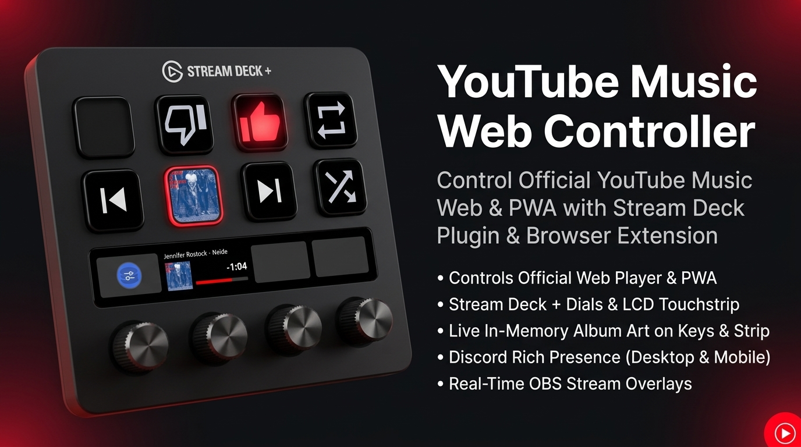

# YouTube Music Web Controller (`ytm-web-controller`)

<p align="center">
  
</p>

<p align="center">
  <a href="https://opensource.org/licenses/MIT"></a>
  <a href="https://github.com/smok3y97/ytm-web-controller/releases"></a>
  <a href="https://www.elgato.com/stream-deck"></a>
  <a href="https://developer.chrome.com/docs/extensions/mv3/intro/"></a>
</p>

An ultra-lightweight, event-driven, resource-efficient open-source controller bridge connecting the official [YouTube Music Web App](https://music.youtube.com) directly to your **Elgato Stream Deck** (including **Stream Deck + Dials & LCD Touchstrips**).

---

## 🌟 Why This Exists

Most existing YouTube Music desktop solutions rely on heavy, outdated 3rd-party Electron wrappers (such as YouTube Music Desktop App / YTMD) that consume hundreds of megabytes of RAM and run unnecessary background processes.

**YouTube Music Web Controller** takes a modern, native approach:
- 🚀 **Use the Official Web Player or PWA**: Enjoy YouTube Music directly in Chrome, Brave, Edge, or Firefox with full official features, latest UI updates, and GPU acceleration.
- ⚡ **Zero Polling (`setInterval() == 0`)**: 100% event-driven architecture using native HTML5 `<video>` events and DOM MutationObservers. The connection remains completely silent and idle when music is paused.
- 🧠 **Zero-Disk Footprint**: Album artwork and dynamic LCD touchstrip graphics are computed and transferred strictly in-memory (RAM) via Base64 Data URLs. No temporary image cache is ever written to your disk.
- 🎮 **Stream Deck + Rotary Dial Support**: Dedicated encoders for Track Skipping, Volume Control, and Quick Seeking/Scrubbing with push-jitter protection, dial push & LCD tap toggles, synchronized marquee title scrolling, and real-time LCD progress bars.
- 🎨 **100% Native Vector SVGs**: Crisp, official Google YouTube Music vector icons that scale perfectly to any Stream Deck key resolution.

---

## 📋 Feature Matrix

| Action | Type | Description |
| :--- | :--- | :--- |
| **Play / Pause** | Dual-State Key | Toggles playback. Optionally renders the live **Album Cover Art as the button background** in RAM or official vector Play/Pause states. |
| **Track Controller (Dial)** | Stream Deck + Dial & LCD | Rotary control for **Track Skipping** (Clockwise: Next / Counter-Clockwise: Previous) with push-jitter suppression. LCD touchstrip displays album thumbnail, auto-scrolling marquee song title & artist, live time/remaining, and progress bar. Tap dial or touchstrip to toggle Play/Pause. |
| **Volume Controller (Dial)** | Stream Deck + Dial & LCD | Dedicated rotary encoder for **Volume Control** with customizable step size (1% – 25% per tick). LCD touchstrip displays real-time volume bar indicator, current volume percentage / MUTED status, and cover/icon. Tap dial or touchstrip to toggle Mute / Unmute. |
| **Seek Controller (Dial)** | Stream Deck + Dial & LCD | Dedicated rotary encoder for **Quick Seeking & Scrubbing** with customizable step size (1s – 60s per tick, default 10s). LCD touchstrip displays real-time track progress bar, current time / remaining time, and cover thumbnail. Tap dial or touchstrip to toggle Play/Pause. |
| **Volume Up** | Key | Increases playback volume by a configurable step (1% – 25%, default 5%) with optional live `{volume}%` text feedback. |
| **Volume Down** | Key | Decreases playback volume by a configurable step (1% – 25%, default 5%) with optional live `{volume}%` text feedback. |
| **Mute / Unmute** | Dual-State Key | Toggles playback mute status with dynamic active/inactive speaker icons. |
| **Next Track** | Key | Skips to the next track. |
| **Previous Track** | Key | Skips to the previous track or restarts the current track. |
| **Like Track** | Dual-State Key | Toggles track thumbs-up with real-time active state highlight. |
| **Dislike Track** | Dual-State Key | Toggles track thumbs-down with real-time active state highlight. |
| **Shuffle** | Dual-State Key | Toggles playlist shuffle mode on/off with real-time active state highlight. |
| **Repeat Mode** | Tri-State Key | Cycles through repeat modes: **Off** ➔ **Repeat All** ➔ **Repeat One (1)**. |
| **Copy Song URL** | Key | Copies the active YouTube Music song URL to your clipboard for instant track sharing, with visual success feedback (`showOk`). |
| **Discord Rich Presence (RPC)** | Service Integration | Real-time Discord presence with live album cover, animated progress bar, clickable track/artist/album links, and custom Application ID support (visible on Desktop & Mobile). |
| **OBS Text Export** | Service Integration | Automatically writes the currently playing track metadata to a local `.txt` file for OBS Studio stream overlays. |

---

## 📸 Screenshots & Live Preview

<p align="center">
  
  <br>
  <em>Stream Deck Plugin Action Setup & Dynamic Key / Dial Configuration</em>
</p>

<table align="center">
  <tr>
    <th align="center">🖥️ Discord Desktop Rich Presence</th>
    <th align="center">📱 Discord Mobile App Rich Presence</th>
  </tr>
  <tr>
    <td align="center" valign="middle">
      
    </td>
    <td align="center" valign="middle">
      
    </td>
  </tr>
</table>

<p align="center">
  <em>Real-time Discord Rich Presence with live timeline progress, cover artwork, and clickable YouTube Music track links across Desktop and Mobile.</em>
</p>

---

## 🧪 Tested Environments & Hardware

This plugin has been tested and verified with:
- **Hardware Controllers**:
  - **Elgato Stream Deck +** (Rotary Dials & LCD Touchstrip)
  - **Corsair Galleon 100 SD** (with Elgato Stream Deck integration)
- **Browsers**:
  - **Google Chrome** 151.0.7922.138 (Official Web Player & PWA)
- **Software**:
  - **Elgato Stream Deck Software** v7.5.1 (22901) (Minimum required: v6.5+)
  - **OBS Studio** (v28+)
  - **Discord** (Desktop 1.0.9253+ & Mobile iOS / Android App)

---

## 🗺️ Roadmap & Planned Features

- 🌐 **Store Distribution**: Publishing the plugin to the **Elgato Marketplace** and the companion extension to the **Chrome Web Store**.

---

## 📦 Installation Guide

### Step 1: Install the Stream Deck Plugin
1. Download the latest `com.smok3y97.ytmusicweb.streamDeckPlugin` from the [Releases](https://github.com/smok3y97/ytm-web-controller/releases) page.
2. Double-click the file to install it directly into Elgato Stream Deck.
3. Open Stream Deck and drag any **YouTube Music** action onto your keys or dials.

### Step 2: Install the Browser Extension
The browser extension connects your YouTube Music tab to the Stream Deck plugin.

> [!TIP]
> **No Git clone or repository download required!** You can simply download the pre-packaged `extension.zip` from the [Releases](https://github.com/smok3y97/ytm-web-controller/releases) page alongside the Stream Deck plugin and extract it anywhere on your PC.

#### Chromium Browsers (Google Chrome, Microsoft Edge, Brave, Opera, Vivaldi):
1. Download and unzip `extension.zip` from the [Releases](https://github.com/smok3y97/ytm-web-controller/releases) page (or use the [`extension/`](extension/) folder from the cloned repository).
2. Navigate to `chrome://extensions` (or `edge://extensions` / `brave://extensions`).
3. Enable **Developer mode** (toggle in the top-right corner).
4. Click **Load unpacked** and select the unzipped `extension` folder.

#### Mozilla Firefox:
1. Download and unzip `extension.zip` from the [Releases](https://github.com/smok3y97/ytm-web-controller/releases) page (or use the [`extension/`](extension/) folder from the cloned repository).
2. Navigate to `about:debugging#/runtime/this-firefox`.
3. Click **Load Temporary Add-on...**.
4. Select `manifest.json` from the unzipped extension directory.

### Step 3: Start Playing Music!
1. Open [music.youtube.com](https://music.youtube.com).
2. The extension automatically connects to your Stream Deck via local WebSocket (`127.0.0.1:39865`).
3. Click the extension popup in your browser toolbar anytime to verify connection status (🟢 **Connected**).

---

## 🎥 OBS Studio Overlay Setup (Text GDI+)

You can display the currently playing track live in your OBS stream overlay using a standard **Text (GDI+)** source:

1. In the Property Inspector of any action (e.g. **Play / Pause** or **Dial**):
   - Enable **Enable OBS text export (.txt)**.
   - Enter your desired target file path (e.g. `C:\Users\YourUsername\Documents\ytm_current_track.txt`).
   - (Optional) Customize the template (e.g. `Currently Playing: {artist} - {title}`).
2. In **OBS Studio**:
   - In your Scene, click the **+** button under **Sources** and select **Text (GDI+)** (or **Text (FreeType 2)** on macOS/Linux).
   - Name the source (e.g. `Current Track`).
   - Check the **Read from file** checkbox.
   - Click **Browse** and select the file path you configured in the Stream Deck Property Inspector (e.g. `ytm_current_track.txt`).
   - Choose your favorite font, size, text color, outline/shadow, and alignment.
   - Click **OK**.
3. Whenever music is played, skipped, or paused in YouTube Music, OBS updates the overlay text immediately in real-time!

---

## ⚙️ Configuration & Customization

### 1. Central Plugin Integrations (Global Settings)
Available across the Property Inspector of every single action and dial:
- **Discord Rich Presence (RPC)**: Activate live Discord profile presence with animated timeline and direct track/artist profile buttons. You can also specify an optional custom Discord Application ID (Default: `1537908230209019954`).
- **Streamer Settings (OBS Text-Export)**:
  - **Enable OBS Export**: Toggle the `.txt` export feature on/off.
  - **File Path**: Absolute path where the text file will be saved (e.g. `C:\Users\username\Documents\ytm_current_track.txt`). The directory is created automatically if it does not exist.
  - **Format Template**: Customize the format. Supports `{artist}`, `{title}`, `{album}` placeholders (Default: `Currently Playing: {artist} - {title}`).
  - **Clear on Pause**: If enabled, empties the text file when music is paused or stopped.
- **Advanced / Connection Settings**:
  - **WebSocket Port** (Default: `39865`): If port `39865` conflicts with other software on your PC, change it here and update the extension popup to match. The server rebinds dynamically without restarting Stream Deck.
  - **Custom Discord Application ID**: Override the default RPC client ID if you create your own Discord Developer App.

### 2. Volume Controllers (Keys & Dial)
- **Volume Up & Volume Down (Keys)**:
  - **Volume Step**: Configurable step size from **1% to 25%** (Default: `5%`).
  - **Show Volume on Key**: Toggle live volume display on the button.
  - **Title Template**: Customize key text format (`{volume}%`, `Vol {volume}%`, `{volume}`).
  - **Font & Position**: Styled using Stream Deck's native **"T" Title Styler** button (Top, Middle, Bottom alignment, font size, and color).
- **Volume Controller (Dial)**:
  - Rotary volume adjustment (1% – 25% per tick).
  - Push dial / tap LCD touchstrip to toggle **Mute / Unmute**.
  - LCD displays real-time volume bar, percentage readout (`100%`, `MUTED`), and cover thumbnail.

### 3. Seek Controller (Dial)
- **Seek Step**: Configurable scrubbing step from **1s to 60s** per rotary click (Default: `10s`).
- **Time Template**: Customize LCD time format (`{current} / {duration}`, `{remaining}`, `{current}`).
- **Title Template**: Auto-scrolling marquee song title and artist (`{artist} - {title}`).
- **Push / Touch Tap**: Toggles Play / Pause with push-jitter protection.

---

## 🛠️ Architecture & Developer Documentation

The project is designed with a strictly decoupled, modular architecture adhering to the Single Responsibility Principle:

- 📖 **[System Architecture & Data Flows (`docs/architecture.md`)](docs/architecture.md)**: Comprehensive technical documentation, end-to-end Mermaid architecture diagrams, service breakdowns, zero-polling lifecycles, and the complete monorepo file tree.
- 📋 **[Marketplace Guidelines Compliance (`docs/plugin-guideline.md`)](docs/plugin-guideline.md)**: Elgato Stream Deck marketplace standards, asset dimensions, performance rate-limiting rules, and packaging specifications.
- 🤖 **[Agent Guidelines (`AGENTS.md`)](AGENTS.md)**: Persistent guidelines for AI coding agents and human contributors.

---

## 🏗️ Development & Building

### Prerequisites
- [Node.js](https://nodejs.org) (v20+ recommended)
- [npm](https://www.npmjs.com)

### Build & Package the Project
You can build and package everything directly from the repository root:

```bash
# 1. Build standalone plugin bundle
npm run build

# 2. Package Stream Deck Plugin (.streamDeckPlugin) & Extension (.zip) into release/
npm run package
# (or execute directly with PowerShell):
powershell -ExecutionPolicy Bypass -File .\package_plugin.ps1

# 3. Validate packaged plugin against official Elgato SDK Schema
npm run validate
# (or directly via npx):
npx streamdeck validate release/com.smok3y97.ytmusicweb.sdPlugin

# Optional: Watch mode for active development
npm run watch
```

---

## 🏷️ Versioning Scheme

This project follows the official **Elgato Stream Deck SDK 2** and **Browser Extension Manifest V3** version specifications:

$$\mathbf{\{Major\}.\{Minor\}.\{Patch\}.\{Build\}}$$

| Component | Format | Example | Purpose |
| :--- | :--- | :--- | :--- |
| **Stream Deck Plugin** (`plugin/manifest.json`) | 4-part numeric (`{M}.{m}.{p}.{b}`) | `1.4.0.0` | Strict Elgato Marketplace requirement (`^(0\|[1-9]\d*)(\.(0\|[1-9]\d*)){3}$`) for automated version comparison. |
| **Browser Extension** (`extension/manifest.json`) | `version`: 4-part numeric<br>`version_name`: string | `"1.4.0.0"`<br>`"1.4.0"` | `version` handles internal browser update checks, while `version_name` provides clean display in Web Stores and UI. |
| **Node.js Packages** (`package.json`) | 4-part / SemVer | `1.4.0.0` | Synchronized versioning across root and plugin package configurations. |

- **Major** (`1`): Significant architectural changes or SDK upgrades.
- **Minor** (`4`): New features (Volume controllers, Seek dial, Marquee service, Base action classes).
- **Patch** (`0`): Bug fixes, icon styling, and metadata corrections.
- **Build** (`0`): Internal marketplace revision counter (incremented on store resubmissions without changing the release version).

---

## 📖 Guidelines & Marketplace Compliance

This project complies strictly with official Elgato Marketplace requirements and modern extension standards:
- **[Elgato Plugin Guidelines](docs/plugin-guideline.md)** (Source: [Elgato Stream Deck Plugin Guidelines](https://docs.elgato.com/guidelines/stream-deck/plugins/)): Specifications for UUIDs, asset dimensions, naming conventions, 10 Hz programmatic rendering limits, and Property Inspector UI design.
- **[AI & Developer Guidelines (AGENTS.md)](AGENTS.md)**: Persistent architectural rules, event-driven patterns, memory buffering, and version synchronization guidelines for contributors and AI agents.

---

## 🤖 AI Usage & Development

This project was developed with the assistance of **Google Antigravity / Gemini AI**, utilizing agentic AI pair programming for architectural design, TypeScript SDK integration, SVG vector asset creation, and performance optimization.

---

## 🤝 Contributing

Contributions, issues, and feature requests are welcome! Feel free to check the [issues page](https://github.com/smok3y97/ytm-web-controller/issues).

1. Fork the Project
2. Create your Feature Branch (`git checkout -b feature/AmazingFeature`)
3. Commit your Changes (`git commit -m 'Add some AmazingFeature'`)
4. Push to the Branch (`git push origin feature/AmazingFeature`)
5. Open a Pull Request

---

## 📄 License

Distributed under the **MIT License**. See [`LICENSE`](LICENSE) for more information.

Developed with ❤️ by **Smok3y97** for the YouTube Music & Stream Deck community.
