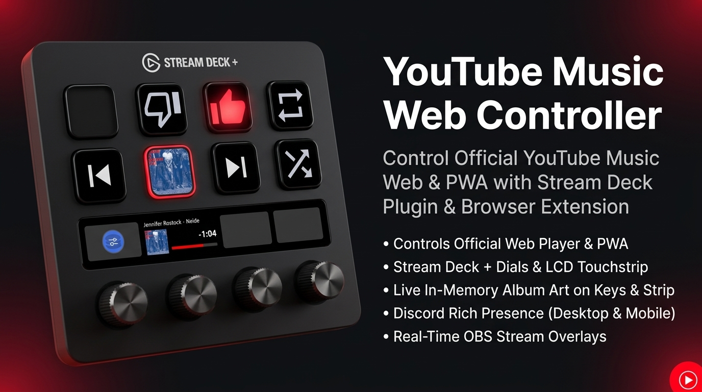

# Controller for YouTube Music Web (`ytm-web-controller`)

  

  
  
  
  
  
  

Control the official [YouTube Music Web Player](https://music.youtube.com) directly from your **Elgato Stream Deck** — without running bulky third-party desktop wrappers. Featuring live album cover art, rotary dial controls for **Stream Deck +**, customizable **OBS Studio stream overlays**, and **Discord** status.

> [!IMPORTANT]
> **Browser Companion Extension Required:**  
> To connect YouTube Music in your browser to Stream Deck, this setup requires **both** the Stream Deck Plugin and the lightweight **Companion Browser Extension** (for Google Chrome, Brave, Microsoft Edge, and other Chromium browsers). Follow the 3-step [Quickstart & Setup](#-quickstart--setup) below to get started in minutes!

> [!NOTE]
> **Legal Disclaimer:** YouTube Music is a trademark of Google LLC. This project is an independent open-source tool developed by Smok3y97 and is not affiliated with, sponsored, or endorsed by Google LLC.

---

## 📑 Table of Contents
- [💡 Why This Plugin?](#-why-this-plugin)
- [🎛️ What You Can Do](#-what-you-can-do)
  - [Stream Deck Keys & Dials](#stream-deck-keys--dials)
  - [Live Streaming & OBS Studio](#live-streaming--obs-studio)
  - [Discord Status](#discord-status)
- [📦 Quickstart & Setup](#-quickstart--setup)
- [📚 Detailed Documentation & Guides](#-detailed-documentation--guides)
- [🤖 AI Collaboration & Transparency](#-ai-collaboration--transparency)
- [🧪 Verified Environments & Hardware](#-verified-environments--hardware)
- [🗺️ Project Roadmap](#-project-roadmap)
- [🔒 Privacy & Local Security](#-privacy--local-security)
- [📄 License](#-license)

---

## 💡 Why This Plugin?

Most YouTube Music desktop integrations force you to install heavy third-party desktop apps that drain your RAM and CPU. **Controller for YouTube Music Web** works directly with your existing browser (Chrome, Brave, Edge):

- 🚀 **Lightweight & Fast:** Uses the official web player or PWA in your browser. Saves memory and CPU power so your PC stays fast while gaming or streaming.
- 🛡️ **100% Private & Local:** All communication stays strictly on your computer. No cloud accounts, no tracking, and no external servers.
- 🖼️ **Clean & Disk-Friendly:** Album artwork and button graphics are drawn instantly on your keys and dials without cluttering your drive with temporary image files.
- 🎛️ **Smooth Hardware Experience:** Specifically tuned for Stream Deck + so displays and dial controls respond smoothly without screen lag.

---

## 🎛️ What You Can Do

### Stream Deck Keys & Dials
- **Stream Deck + Rotary Dials:** Turn dials to skip songs, adjust volume, or scrub through tracks. Push the dial or tap the LCD screen to play/pause or mute.
- **Dynamic LCD Touchstrips:** See live song titles, artist names with smooth text scrolling, time progress bars, and album art thumbnails right above your dials.
- **Keys with Live Album Art:** Use the current song cover as your Play/Pause button background with optional song title or time text on top.
- **Essential Music Controls:** Next/Previous track, Volume Up/Down, Mute, Fast Forward, Rewind, Like/Dislike, Shuffle, Repeat (Off ➔ All ➔ One), and One-Click Copy Song Link.
- **Action Catalog:** For a complete breakdown of every button and dial, see the **[Feature Matrix & Action Reference (`docs/features.md`)](docs/features.md)**.

### Live Streaming & OBS Studio
- **Now-Playing Stream Overlay:** Add an animated music widget to OBS Studio with live album art, progress bar, and customizable themes (`card`, `compact`, `pill`) and colors.
- **Chatbot Command (`!song`):** Let your Twitch or YouTube viewers check what song is currently playing via Streamer.bot or MixItUp.
- **Classic OBS Text Export:** Automatically write song info to a simple text file (`.txt`) for classic OBS text sources.
- **Setup Guide:** Step-by-step setup instructions are available in the **[OBS Studio & Chatbot Setup Guide (`docs/obs-setup.md`)](docs/obs-setup.md)**.

### Discord Status
- **Rich Presence (RPC):** Show what you are listening to on Discord with album art, artist, and animated timeline progress across Discord Desktop and Mobile.

---

## 📦 Quickstart & Setup

### Step 1: Install the Stream Deck Plugin
1. Download the latest `com.smok3y97.ytmusicweb.streamDeckPlugin` from the [Releases](https://github.com/smok3y97/ytm-web-controller/releases) page.
2. Double-click the downloaded file to install it into your Elgato Stream Deck app.
3. Drag any **YouTube Music** action onto your keys or dials.

### Step 2: Install the Browser Extension
1. Download and extract `extension.zip` from the [Releases](https://github.com/smok3y97/ytm-web-controller/releases) page.
2. In your browser (Chrome, Edge, Brave), go to `chrome://extensions`.
3. Turn on **Developer mode** (toggle in the top-right corner) and click **Load unpacked**.
4. Select the extracted `extension` folder.

### Step 3: Play Your Music
1. Open [music.youtube.com](https://music.youtube.com) and start playing music.
2. The extension connects automatically to your Stream Deck.
3. To customize volume steps, text formatting, or colors, check the **[Configuration Guide (`docs/configuration.md`)](docs/configuration.md)**.

---

## 📚 Detailed Documentation & Guides

Looking for deeper technical details, developer instructions, or customization options? Explore our specialized guides:

| Guide | What It Covers |
| :--- | :--- |
| 📋 **[Feature Matrix & Action Reference](docs/features.md)** | Full list of all buttons, dials, actions, and hardware interactions. |
| 🎥 **[OBS Studio & Chatbot Setup Guide](docs/obs-setup.md)** | Step-by-step guide for stream overlays, chatbot commands, and text sources. |
| ⚙️ **[Configuration & Customization Guide](docs/configuration.md)** | Settings, volume sliders, Discord options, and **[Template Tokens Reference](docs/configuration.md#4-template-tokens--formatting-placeholders)**. |
| 🏛️ **[System Architecture & Data Flows](docs/architecture.md)** | Technical deep-dive into WebSocket communication, services, and diagrams. |
| 🏗️ **[Development & Contribution Guide](docs/development.md)** | Build instructions, local setup, packaging scripts, and versioning rules. |
| 📝 **[Commit Conventions & Categories](docs/commit-conventions.md)** | Conventional Commit standard, category emojis, and automated release notes. |
| 📋 **[Marketplace Guidelines Compliance](docs/plugin-guideline.md)** | Elgato Stream Deck Marketplace compliance and icon asset rules. |
| 🤖 **[AI Collaboration & Transparency](docs/ai-disclosure.md)** | Transparent documentation of AI pair programming with Google Antigravity. |
| 🤝 **[Community Contribution Guidelines](CONTRIBUTING.md)** | How to report bugs, suggest features, and submit pull requests. |
| 📜 **[Code of Conduct](CODE_OF_CONDUCT.md)** | Community pledge and behavior guidelines. |
| 🔒 **[Security Policy](SECURITY.md)** | Local-first security architecture and vulnerability reporting. |
| 📋 **[Agent & Developer Guidelines](AGENTS.md)** | Technical directives and operational guardrails for contributors. |

---

## 🤖 AI Collaboration & Transparency

This project is developed with transparent AI collaboration: code architecture, build automation, vector icons, and documentation were created in pair programming with **Google Antigravity / Gemini AI** under the architectural direction and feature specification of the maintainer (**Smok3y97**). Every feature, rotary dial behavior, and UI element is physically tested and verified on live Stream Deck hardware.

For detailed hardware testing environments, verification protocols, and development practices, see **[AI Collaboration & Transparency (`docs/ai-disclosure.md`)](docs/ai-disclosure.md)**.

---

## 🧪 Verified Environments & Hardware

All releases and features are physically tested and validated on live hardware:

- **Hardware:** Elgato Stream Deck +, Corsair Galleon 100 SD
- **Environment:** Windows 11, Google Chrome (Web Player & PWA), Discord Desktop, OBS Studio
- **Details:** For build numbers and full verification protocols, see the **[Verified Environments Reference in `docs/ai-disclosure.md`](docs/ai-disclosure.md#3-hardware-testing--verified-environments)**.

---

## 🗺️ Project Roadmap

- 🏬 **Elgato Stream Deck Marketplace Listing:** Direct one-click install and automatic updates inside the Stream Deck app.
- 🌐 **Chrome Web Store Release:** One-click companion extension install directly from the Chrome Web Store.
- 🎵 **Extended Player Controls:** Additional button actions for video mode switching and radio mixes.

---

## 🔒 Privacy & Local Security

- **Zero Telemetry:** No user tracking, no analytics, and no data collection of any kind.
- **Local Isolation:** The extension and plugin communicate exclusively on your own computer (`127.0.0.1`).
- **Read the Full Policy:** For complete disclosures, see **[Privacy Policy (`PRIVACY.md`)](PRIVACY.md)**.

---

## 📄 License

This project is open-source software licensed under the [MIT License](LICENSE).
