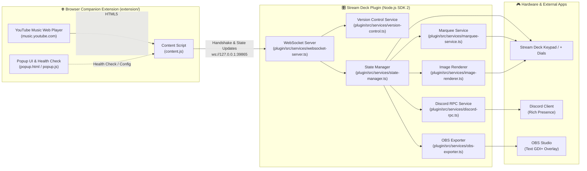

# System Architecture & Technical Specifications (`docs/architecture.md`)

This document provides an in-depth technical overview of the **YouTube Music Web Controller** monorepo architecture, design principles, and component interactions.

---

## 🏛️ 1. High-Level System Overview

The project bridges the official [YouTube Music Web App](https://music.youtube.com) and the [Elgato Stream Deck](https://www.elgato.com/stream-deck) hardware using an event-driven, local WebSocket connection with bidirectional version handshake validation.



---

## 🧩 2. Core Architectural Principles

1. **Zero-Polling (`setInterval == 0`)**:
   - The browser extension never polls the DOM on a periodic interval.
   - All state extractions are reactive, triggered strictly by native HTML5 `<video>` events (`play`, `pause`, `timeupdate`, `seeking`, `seeked`, `ratechange`, `volumechange`) and scoped `MutationObserver` callbacks on music metadata nodes.
   - When music is stopped or paused, CPU and network overhead drop to zero.

2. **Zero Disk Footprint**:
   - Dynamic LCD touchstrip layouts, animated dials, and album cover thumbnails are computed entirely in memory (RAM) and encoded as Base64 Data URLs.
   - No temporary image files are ever written to disk.

3. **Single Responsibility Principle (SRP) & Decoupling**:
   - Every system responsibility is encapsulated in an isolated service or component.
   - Action classes do not directly interact with raw sockets or third-party SDKs; they consume backend services via clean Singleton interfaces.

4. **Modular Version Control & Handshake**:
   - Versions are verified bidirectionally upon WebSocket connection before state processing.
   - Version rules, comparisons, and warning strings are centralized in `VersionControlService` with zero hardcoded version literals in action controllers.

---

## 🏗️ 3. Complete Monorepo Structure

```
ytm-web-controller/
├── version.json                 # Single Source of Truth for project version
├── package.json                 # Monorepo root package configuration & npm scripts
├── AGENTS.md                    # Persistent Developer & AI Agent Guidelines
├── LICENSE                      # MIT License
├── README.md                    # User guide, installation walkthrough & setup documentation
├── scripts/                     # Workspace automation & deployment scripts
│   ├── bump-version.mjs         # Centralized 5-file version synchronization script
│   └── package_plugin.ps1       # Packaging, asset generation & Stream Deck deployment script
├── docs/                        # Technical specifications & developer documentation
│   ├── ai-disclosure.md         # AI development transparency disclosure
│   ├── architecture.md          # Complete system architecture specification & diagrams
│   ├── configuration.md         # Configuration options & template format guide
│   ├── development.md           # Developer workflow, build & bump commands
│   ├── obs-setup.md             # OBS Studio stream overlay guide
│   └── plugin-guideline.md      # Elgato Marketplace compliance guidelines
├── screenshots/                 # Preview assets & documentation screenshots
│   ├── Banner.png               # GitHub repository hero banner
│   ├── StreamDeck.png           # Stream Deck action configuration preview
│   ├── Discord-Desktop-RPC.png  # Discord Desktop Rich Presence preview
│   └── Discord-Mobile-RPC.png   # Discord Mobile App Rich Presence preview
├── extension/                   # Manifest V3 Browser Companion Extension
│   ├── manifest.json            # MV3 Manifest with Chromium & Firefox Gecko compatibility
│   ├── bridge.js                # ISOLATED world bridge for chrome.storage & manifest version
│   ├── content.js               # Reactive DOM observer, WebSocket client & handshake engine
│   ├── popup.html               # Extension status, version diagnostics & port configuration UI
│   ├── popup.css                # Extension popup dark theme stylesheet
│   ├── popup.js                 # Port storage & live connection diagnostic tester
│   └── icons/                   # Extension toolbar icons (16, 48, 128 px)
└── plugin/                      # Stream Deck Plugin (Node.js SDK 2)
    ├── manifest.json            # Stream Deck Plugin Manifest (com.smok3y97.ytmusicweb)
    ├── package.json             # Plugin dependencies & rollup build scripts
    ├── rollup.config.mjs        # Rollup bundler configuration
    ├── tsconfig.json            # TypeScript compiler configuration
    ├── assets/                  # High-resolution vector & raster assets
    │   ├── category-icon.svg    # Monochromatic category icon (28x28 / 56x56)
    │   ├── plugin-icon.png      # Official Full-Color YouTube Music badge (256x256)
    │   ├── plugin-icon@2x.png   # High-DPI YouTube Music badge (512x512)
    │   ├── generate_assets.ps1  # Automated asset generator script
    │   └── actions/             # SVG action icons (playpause, dial, volumedial, etc.)
    ├── layouts/                 # Stream Deck + Dial LCD JSON layouts
    │   └── dial_layout.json     # Single-source-of-truth 4-item LCD strip layout
    ├── ui/                      # Modular Property Inspector (PI) Frontend
    │   ├── streamdeck-client.js # Low-level Stream Deck WebSocket SDK bridge
    │   ├── global-settings.js   # Global settings UI component (Discord / Streamer / Top Mismatch banner)
    │   ├── common.html          # Standard inspector for stateless/trigger keys
    │   ├── dial.html / dial.js  # Track Controller Dial inspector
    │   ├── volume-dial.html/.js # Volume Controller Dial inspector
    │   ├── seek-dial.html/.js   # Seek Controller Dial inspector
    │   ├── playpause.html/.js   # Play/Pause inspector (Album cover toggle)
    │   ├── volume.html/.js      # Volume Up & Down keys inspector
    │   └── css/sdpi.css         # Stream Deck Property Inspector stylesheet
    └── src/                     # Backend Source Code (TypeScript)
        ├── index.ts             # Plugin entry point & action registration
        ├── types/               # TypeScript interfaces & event payloads
        ├── services/            # Decoupled backend services layer
        │   ├── version-control.ts   # Centralized version control & handshake validator
        │   ├── websocket-server.ts  # Local WebSocket server (port 39865)
        │   ├── state-manager.ts     # Centralized playback state store
        │   ├── marquee-service.ts   # Centralized Ping-Pong marquee scroller
        │   ├── image-renderer.ts    # In-memory RAM base64 canvas renderer
        │   ├── warning-icons.ts     # Dynamic SVG warning icon generator for mismatch states
        │   ├── discord-rpc.ts       # Isolated Discord Rich Presence client
        │   ├── obs-exporter.ts      # Live .txt track info exporter for OBS
        │   └── clipboard.ts         # Native clipboard bridge for song URL copying
        └── actions/             # Independent Action Controllers
            ├── base-state-action.ts  # Base class for stateful keypad buttons
            ├── base-volume-action.ts # Base class for volume keypad buttons
            ├── play-pause.ts    # Play / Pause dual-state key handler
            ├── dial.ts          # Track Controller (Dial & LCD)
            ├── volume-dial.ts   # Volume Controller (Dial & LCD)
            ├── seek-dial.ts     # Seek Controller (Dial & LCD)
            ├── volume-up.ts     # Volume Up key
            ├── volume-down.ts   # Volume Down key
            ├── mute.ts          # Mute / Unmute toggle key
            ├── next.ts          # Next Track key
            ├── previous.ts      # Previous Track key
            ├── like.ts          # Like Track key
            ├── dislike.ts       # Dislike Track key
            ├── shuffle.ts       # Shuffle toggle key
            ├── repeat.ts        # Repeat mode cycle key
            └── copy-url.ts      # Copy Song URL key
```

---

## 🌐 4. Browser Companion Extension Layer (`extension/`)

The browser companion extension runs in the context of `https://music.youtube.com/*` and acts as the bridge between YouTube Music's web player DOM and the local Stream Deck WebSocket server.

### 📄 Component Breakdown:

1. **Manifest Configuration ([`extension/manifest.json`](../extension/manifest.json))**:
   - Built on **Manifest V3**.
   - Fully compatible with **Chromium** (Chrome, Brave, Edge, Opera, Vivaldi) and **Gecko** (Mozilla Firefox via `browser_specific_settings`).
   - Requests minimal permissions: `"storage"` (persisting custom WebSocket port) and host permission `"https://music.youtube.com/*"`.

2. **Isolated World Bridge ([`extension/bridge.js`](../extension/bridge.js))**:
   - Injected into `music.youtube.com` with default `ISOLATED` world execution.
   - Accesses `chrome.storage.local` and `chrome.runtime.getManifest()`.
   - Bridges manifest version, custom WebSocket port, and version mismatch status bidirectionally to `content.js` via `window.postMessage`.

3. **Content Script Engine ([`extension/content.js`](../extension/content.js))**:
   - Injected into `music.youtube.com` with `world: "MAIN"` execution to access media elements directly.
   - **Cross-Browser Runtime Resolution**: Dynamically detects runtime (`chrome` vs. `browser`) and browser platform (`firefox`, `edge`, `brave`, `chromium`, `opera`, `vivaldi`).
   - **Immediate Handshake**: Transmits `{ type: "handshake", version: manifestVersion, platform: platform }` on socket open before dispatching playback states.
   - **HTML5 `<video>` Event Subscriptions**: Binds to `play`, `pause`, `timeupdate`, `seeking`, `seeked`, `ratechange`, `volumechange`, and `ended`.
   - **Targeted MutationObserver**: Listens specifically to `#layout`, `.middle-controls`, `ytmusic-player-bar`, and rating buttons without expensive full-document scans.
   - **Command Dispatcher**: Executes incoming remote commands from Stream Deck (`play`, `pause`, `next`, `previous`, `adjustVolume`, `toggleMute`, `seekRelative`, etc.).
   - **Resilient WebSocket Lifecycle**: Connects to `ws://127.0.0.1:${port}` with automated exponential backoff and reconnection if the Stream Deck plugin restarts.

4. **Extension Popup & Health Monitor ([`extension/popup.html`](../extension/popup.html), [`popup.js`](../extension/popup.js), [`popup.css`](../extension/popup.css))**:
   - Provides instant visual connection diagnostics (🟢 **Connected** / ⚠️ **Version Mismatch** / 🔴 **Disconnected**).
   - Dynamically checks version compatibility and renders clear upgrade instructions.
   - Allows users to change and persist custom WebSocket ports via storage API.

---

## 🔌 5. Backend Services Layer (`plugin/src/services/`)

| Service | File | Responsibility |
| :--- | :--- | :--- |
| **Version Control** | [`version-control.ts`](../plugin/src/services/version-control.ts) | Centralized single-source-of-truth for version comparison, handshake validation, and dynamic warning messaging. |
| **WebSocket Server** | [`websocket-server.ts`](../plugin/src/services/websocket-server.ts) | Hosts local `ws.Server` (port `39865`), handles connection lifecycles, and dispatches JSON commands. |
| **State Manager** | [`state-manager.ts`](../plugin/src/services/state-manager.ts) | Centralized, single-source-of-truth playback store emitting `stateChanged` events. |
| **Marquee Service** | [`marquee-service.ts`](../plugin/src/services/marquee-service.ts) | Centralized Ping-Pong (bounce) scroller with character-width estimation for Stream Deck + LCDs. |
| **Image Renderer** | [`image-renderer.ts`](../plugin/src/services/image-renderer.ts) | In-memory RAM base64 cover/canvas rendering without disk I/O. |
| **Warning Icons** | [`warning-icons.ts`](../plugin/src/services/warning-icons.ts) | Generates dynamic pixel-perfect SVG warning badges for keypad actions during version mismatch. |
| **Discord RPC** | [`discord-rpc.ts`](../plugin/src/services/discord-rpc.ts) | Isolated Discord Rich Presence client with automatic backoff and reconnection. |
| **OBS Exporter** | [`obs-exporter.ts`](../plugin/src/services/obs-exporter.ts) | Isolated text file exporter for streamers (`.txt` overlay files). |
| **Clipboard** | [`clipboard.ts`](../plugin/src/services/clipboard.ts) | Cross-platform clipboard bridge for song URL sharing. |

---

## 🕹️ 6. Action Controllers Layer (`plugin/src/actions/`)

Each Stream Deck key and dial is an independent controller registered with the `@elgato/streamdeck` SDK:

* **Base Controllers**:
  * [`base-state-action.ts`](../plugin/src/actions/base-state-action.ts): Common base class handling connection indicators, dynamic SVG state switching, version mismatch guards, and StateManager lifecycle.
  * [`base-volume-action.ts`](../plugin/src/actions/base-volume-action.ts): Common base class for volume keys handling percentage formatting and Title Styler integration.
* **Keypad Actions**:
  * [`play-pause.ts`](../plugin/src/actions/play-pause.ts): Dual-state key with live album art canvas background rendering.
  * [`volume-up.ts`](../plugin/src/actions/volume-up.ts) & [`volume-down.ts`](../plugin/src/actions/volume-down.ts): Step-based volume adjustment with live `{volume}%` text.
  * [`mute.ts`](../plugin/src/actions/mute.ts), [`next.ts`](../plugin/src/actions/next.ts), [`prev.ts`](../plugin/src/actions/prev.ts), [`like.ts`](../plugin/src/actions/like.ts), [`dislike.ts`](../plugin/src/actions/dislike.ts), [`shuffle.ts`](../plugin/src/actions/shuffle.ts), [`repeat.ts`](../plugin/src/actions/repeat.ts), [`copyurl.ts`](../plugin/src/actions/copyurl.ts).
* **Stream Deck + Rotary Dials & LCD Touchstrips**:
  * [`dial.ts`](../plugin/src/actions/dial.ts) (Track Controller): Rotary track skipping, tap play/pause, animated LCD layout with marquee title scroller, progress bar, and dynamic mismatch warning.
  * [`volume-dial.ts`](../plugin/src/actions/volume-dial.ts) (Volume Controller): Rotary volume control, tap mute/unmute, live percentage and volume bar LCD feedback.
  * [`seek-dial.ts`](../plugin/src/actions/seek-dial.ts) (Seek Controller): Rotary scrub controller, tap play/pause, live time and progress LCD indicator.

---

## 🎨 7. Property Inspector (PI) Modular Architecture (`plugin/ui/`)

The Property Inspector frontend uses a component-based modular structure:

```
┌──────────────────────────────────────────────────────────┐
│  Property Inspector View (e.g. dial.html / volume.html)  │
├──────────────────────────────────────────────────────────┤
│  0. Version Warning Banner (id="version-warning-banner") │
│     - Dynamically rendered on mismatch                   │
├──────────────────────────────────────────────────────────┤
│  1. Action-Specific Controls (Local Inputs)              │
│     - Handled by action script (e.g. dial.js)            │
│     - Uses StreamDeckClient.onLocalSettings() / save()   │
├──────────────────────────────────────────────────────────┤
│  2. Global Plugin Settings (<div id="global-settings">)  │
│     - Injected dynamically by global-settings.js         │
│     - Discord Rich Presence (RPC) Toggle                 │
│     - Streamer Settings (OBS Export Accordion)           │
│     - Advanced / Connection Settings Accordion           │
├──────────────────────────────────────────────────────────┤
│  3. StreamDeckClient Bridge (streamdeck-client.js)       │
│     - Low-level WebSocket client to Stream Deck software │
│     - Auto-save dispatch (setSettings/setGlobalSettings) │
└──────────────────────────────────────────────────────────┘
```

---

## 🔒 8. Version Handshake & Incompatibility Warning Protocol

1. **Handshake Sequence**:
   - Extension connects to `ws://127.0.0.1:<port>` and immediately transmits:
     ```json
     {
       "type": "handshake",
       "version": "1.5.0.0",
       "platform": "chromium"
     }
     ```
   - Plugin validates version with `VersionControlService.compareVersions()`:
     - **Compatible (`>= 1.5.0.0`)**: Plugin responds with `{"type": "handshake_ack", "version": "1.5.0.0", "compatible": true}`.
     - **Incompatible (`< 1.5.0.0`)**: Plugin responds with `{"type": "version_mismatch", "requiredPluginVersion": "1.5.0.0", ...}`.

2. **Two-Level Status Diagnostics (Extension Popup)**:
   - **Layer 1 - Transport / Socket State (Header Badge)**:
     - 🟢 **Connected**: WebSocket connection on `ws://127.0.0.1:<port>` is active and reachable. Confirms that the configured port is correct and not blocked by firewall.
     - 🔴 **Disconnected**: Socket connection failed (Stream Deck app closed, plugin not installed, or incorrect port).
   - **Layer 2 - Protocol Compatibility State (Card Banner)**:
     - When a version mismatch occurs, the header badge stays 🟢 **Connected** (confirming healthy network/port communication), while the dedicated **`⚠️ Version Mismatch` Card** renders prominently with required version details and upgrade guidance.

3. **Incompatibility Feedback Across Components**:
   - **Hardware Keypad**: Displays pixel-perfect dynamic SVG warning icon with amber badge (`⚠️`) on all keys; triggers `showAlert()` on key press.
   - **Hardware Dials & Touchstrip**: LCD title displays dynamic warning string (e.g. `⚠️ Update Ext. (v1.5.1+)`) and `Mismatch` value.
   - **Property Inspector**: Top banner displays dynamic upgrade notice as the very first element with direct link to GitHub Releases.
   - **Browser Extension Popup**: Displays 🟢 **Connected** socket state with prominent **`⚠️ Version Mismatch`** requirement card.

4. **Centralized Version Management & Synchronization (`npm run bump`)**:
   The monorepo uses a single-command automated version synchronization mechanism. You only define the version in [`version.json`](../version.json) or run:
   ```bash
   npm run bump <version>
   # Example:
   npm run bump 1.5.0.0
   ```

   The script [`scripts/bump-version.mjs`](../scripts/bump-version.mjs) automatically validates and updates all 5 manifest/package files across the workspace:

   | File | Property / Field | Format Example | Purpose & Requirement |
   | :--- | :--- | :--- | :--- |
   | [`version.json`](../version.json) | `"version"` | `"1.5.0.0"` | **Single Source of Truth** for the entire project. |
   | [`plugin/manifest.json`](../plugin/manifest.json) | `"Version"` | `"1.5.0.0"` | **Strict 4-digit numeric string** (`major.minor.patch.build`) required by Elgato Stream Deck CLI validator. |
   | [`extension/manifest.json`](../extension/manifest.json) | `"version"`<br>`"version_name"` | `"1.5.0.0"`<br>`"1.5.0"` | `version` must be 4 numeric parts for automated browser update comparison; `version_name` defines user-facing display string. |
   | [`plugin/package.json`](../plugin/package.json) | `"version"` | `"1.5.0.0"` | Plugin package version synchronized with plugin manifest. |
   | [`package.json`](../package.json) | `"version"` | `"1.5.0.0"` | Monorepo root package version. |
   | [`plugin/src/services/version-control.ts`](../plugin/src/services/version-control.ts) | Dynamic Import | — | Dynamically imports `manifest.json` at build time; requires **zero** manual editing. |

---

## ⚡ 9. Stream Deck + Rotary Encoder & LCD Handling

* **Push-Jitter Suppression**: Ignores accidental rotary clicks within 250ms of a physical dial push.
* **Rotary Debounce Batching**: Batches rapid encoder turns over an 85ms window for smooth volume and scrubbing controls.
* **Ping-Pong Marquee**: Replaces jarring infinite conveyer loops with smooth back-and-forth bounce scrolling (~3.1 Hz) with 2.9s start and 2.5s end reading pauses.
* **10 Hz Rate Limit**: Prevents programmatic feedback flooding to protect hardware performance.
