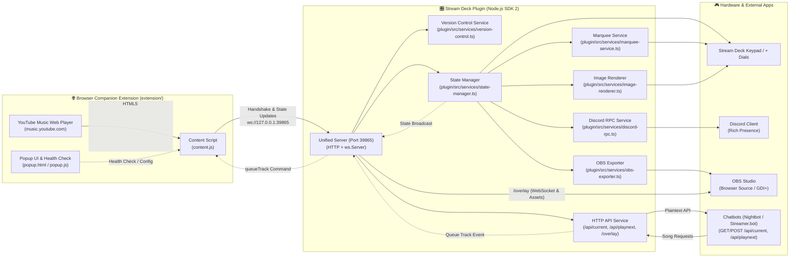
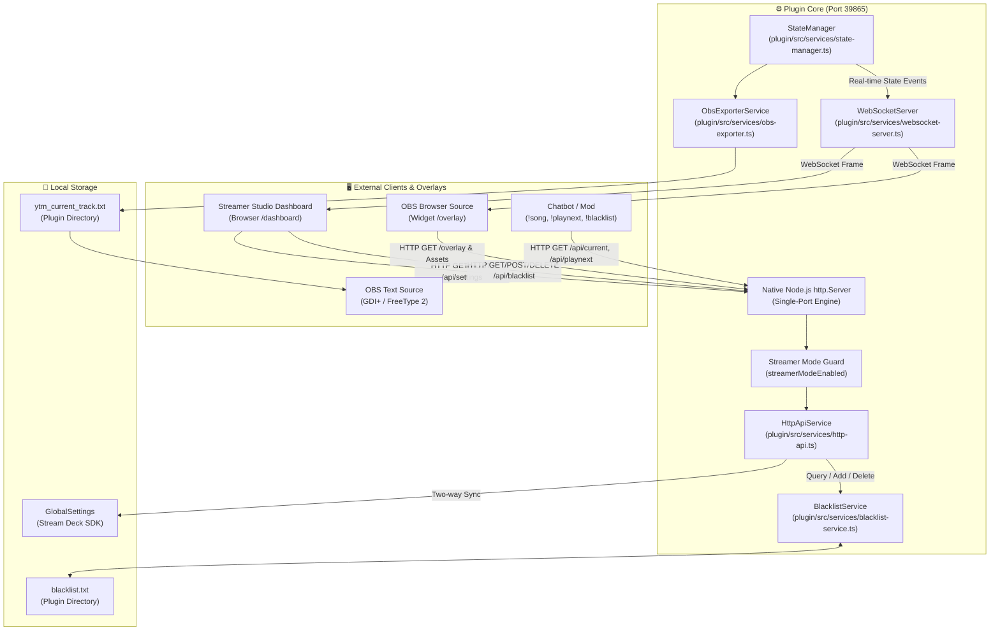

<a id="top"></a>

# System Architecture & Technical Specifications (`docs/architecture.md`)

This document provides an in-depth technical overview of the **YouTube Music Web Controller** monorepo architecture, design principles, and component interactions.

---

## 📑 Table of Contents
- [🏛️ 1. High-Level System Overview](#-1-high-level-system-overview)
- [🧩 2. Core Architectural Principles](#-2-core-architectural-principles)
- [🏗️ 3. Complete Monorepo Structure](#-3-complete-monorepo-structure)
- [🌐 4. Browser Companion Extension Layer (`extension/`)](#-4-browser-companion-extension-layer-extension)
- [🔌 5. Backend Services Layer (`plugin/src/services/`)](#-5-backend-services-layer-pluginsrcservices)
- [🕹️ 6. Action Controllers Layer (`plugin/src/actions/`)](#-6-action-controllers-layer-pluginsrcactions)
- [🎨 7. Property Inspector (PI) Modular Architecture (`plugin/ui/`)](#-7-property-inspector-pi-modular-architecture-pluginui)
- [🔒 8. Version Handshake & Incompatibility Warning Protocol](#-8-version-handshake--incompatibility-warning-protocol)
- [⚡ 9. Stream Deck + Dial & LCD Handling](#-9-stream-deck--dial--lcd-handling)
- [🎥 10. Streamer Studio, HTTP API & Overlay Architecture](#-10-streamer-studio-http-api--overlay-architecture)

---

## [🏛️ 1. High-Level System Overview](#top)

The project bridges the official [YouTube Music Web App](https://music.youtube.com) and the [Elgato Stream Deck](https://www.elgato.com/stream-deck) hardware using an event-driven, local WebSocket connection with bidirectional version handshake validation.



---

## [🧩 2. Core Architectural Principles](#top)

1. **Zero-Polling (`setInterval == 0`)**:
   - The browser extension never polls the DOM on a periodic interval.
   - All state extractions are reactive, triggered strictly by native HTML5 `<video>` events (`play`, `pause`, `timeupdate`, `seeking`, `seeked`, `ratechange`, `volumechange`) and scoped `MutationObserver` callbacks on music metadata nodes.
   - When music is stopped or paused, CPU and network overhead drop to zero.

2. **Zero Disk Footprint**:
   - Dynamic LCD touchstrip layouts, animated dials, and album cover thumbnails are computed entirely in memory (RAM) and encoded as Base64 Data URLs.
   - No temporary image files are ever written to disk.

3. **Single Responsibility Principle (SRP) & Decoupling**:
   - Every system responsibility is encapsulated in an isolated service or component.
   - Action classes do not directly interact with raw sockets or third-party SDKs; they consume backend services via clean Singleton interfaces.

4. **Modular Version Control & Handshake**:
   - Versions are verified bidirectionally upon WebSocket connection before state processing.
   - Version rules, comparisons, and warning strings are centralized in `VersionControlService` with zero hardcoded version literals in action controllers.

5. **Non-Interruptive Remote Queuing**:
   - Song requests from chatbots (`/api/playnext`, `/api/queue`) are injected directly via Shadow-DOM-piercing custom events (`yt-play-next-action`, `yt-add-to-queue-action`) without halting, restarting, or stuttering active playback.

---

## [🏗️ 3. Complete Monorepo Structure](#top)

```
ytm-web-controller/
├── version.json                 # Single Source of Truth for project version
├── package.json                 # Monorepo root package configuration & npm scripts
├── AGENTS.md                    # Persistent Developer & AI Agent Guidelines
├── LICENSE                      # MIT License
├── README.md                    # User guide, installation walkthrough & setup documentation
├── scripts/                     # Workspace automation & deployment scripts
│   ├── bump-version.mjs         # Centralized 5-file version synchronization script
│   ├── package_plugin.ps1       # Packaging, asset generation & Stream Deck deployment script
│   └── ytm-focus.cs             # Standalone C# source for native Win32 window focus binary
├── docs/                        # Technical specifications & developer documentation
│   ├── ai-disclosure.md         # AI development transparency disclosure
│   ├── architecture.md          # Complete system architecture specification & diagrams
│   ├── configuration.md         # Configuration options & template format guide
│   ├── development.md           # Developer workflow, build & bump commands
│   ├── features.md              # Complete feature matrix & action reference
│   ├── obs-setup.md             # OBS Studio stream overlay guide
│   └── plugin-guideline.md      # Elgato Marketplace compliance guidelines
├── screenshots/                 # Preview assets & documentation screenshots
│   ├── Banner.png               # GitHub repository hero banner
│   ├── StreamDeck.png           # Stream Deck action configuration preview
│   ├── OBS-Browser-Overlay.png  # OBS Studio Browser Source overlay preview
│   ├── Discord-Desktop-RPC.png  # Discord Desktop Rich Presence preview
│   └── Discord-Mobile-RPC.png   # Discord Mobile App Rich Presence preview
├── extension/                   # Manifest V3 Browser Companion Extension
│   ├── manifest.json            # MV3 Manifest with Chromium & Firefox Gecko compatibility
│   ├── background.js            # MV3 service worker for tab and window foreground activation
│   ├── bridge.js                # ISOLATED world bridge for chrome.storage & manifest version
│   ├── content.js               # Reactive DOM observer, WebSocket client & queue dispatcher
│   ├── popup.html               # Extension status, version diagnostics & port configuration UI
│   ├── popup.css                # Extension popup dark theme stylesheet
│   ├── popup.js                 # Port storage & live connection diagnostic tester
│   └── icons/                   # Extension toolbar icons (16, 48, 128 px)
├── plugin/                      # Stream Deck Plugin (Node.js SDK 2)
│   ├── manifest.json            # Stream Deck Plugin Manifest (com.smok3y97.ytmusicweb)
│   ├── package.json             # Plugin dependencies & rollup build scripts
│   ├── rollup.config.mjs        # Rollup bundler configuration
│   ├── tsconfig.json            # TypeScript compiler configuration
│   ├── bin/                     # Compiled plugin artifacts
│   │   ├── plugin.js            # Node.js Rollup bundle
│   │   └── ytm-focus.exe        # Native 7 KB Win32 foreground activation binary
│   ├── assets/                  # High-resolution vector & raster assets
    │   ├── category-icon.svg    # Monochromatic category icon (28x28 / 56x56)
    │   ├── plugin-icon.png      # Official Full-Color YouTube Music badge (256x256)
    │   ├── plugin-icon@2x.png   # High-DPI YouTube Music badge (512x512)
    │   ├── generate_assets.ps1  # Automated asset generator script (PNG & invokes SVG generator)
    │   ├── generate_official_svgs.mjs # Official SVG vector icons generator
    │   ├── dashboard/           # Streamer Studio Web Dashboard assets (/dashboard)
    │   │   ├── index.html       # 3-Column Studio Dashboard DOM structure
    │   │   ├── style.css        # Responsive dark slate stylesheet
    │   │   └── dashboard.js     # Live WebSocket sync, overlay generator & settings REST client
    │   ├── overlay/             # OBS Studio Browser Source overlay assets (/overlay)
    │   │   ├── index.html       # Transparent overlay widget DOM structure
    │   │   ├── style.css        # Responsive frosted dark theme & animation styles
    │   │   └── overlay.js       # Live WebSocket client & URL parameter parser
    │   └── actions/             # SVG action icons (playpause, trackdial, toggle-requests, etc.)
    ├── layouts/                 # Stream Deck + Dial LCD JSON layouts
    │   └── dial_layout.json     # Single-source-of-truth 4-item LCD strip layout
    ├── ui/                      # Modular Property Inspector (PI) Frontend
    │   ├── streamdeck-client.js # Low-level Stream Deck WebSocket SDK bridge
    │   ├── global-settings.js   # Global settings UI component (Discord / Streamer / Blacklist)
    │   ├── common.html          # Standard inspector for stateless/trigger keys
    │   ├── track-dial.html/.js  # Track Controller Dial inspector
    │   ├── volume-dial.html/.js # Volume Controller Dial inspector
    │   ├── seek-dial.html/.js   # Seek Controller Dial inspector
    │   ├── playpause.html/.js   # Play/Pause inspector (Album cover toggle)
    │   ├── toggle-requests.html/.js # Toggle Song Requests action inspector
    │   ├── blacklist-and-skip.html/.js # Blacklist & Skip action inspector
    │   ├── volume.html/.js      # Volume Up & Down keys inspector
    │   └── css/sdpi.css         # Stream Deck Property Inspector stylesheet
    └── src/                     # Backend Source Code (TypeScript)
        ├── index.ts             # Plugin entry point & action registration
        ├── types/               # TypeScript interfaces & event payloads
        ├── services/            # Decoupled backend services layer
        │   ├── version-control.ts   # Centralized version control & handshake validator
        │   ├── websocket-server.ts  # Unified Server (Port 39865: HTTP + WebSocket)
        │   ├── http-api.ts          # Zero-dependency HTTP API & overlay static asset router
        │   ├── state-manager.ts     # Centralized playback state store
        │   ├── marquee-service.ts   # Centralized Ping-Pong marquee scroller
        │   ├── image-renderer.ts    # In-memory RAM base64 canvas renderer
        │   ├── warning-icons.ts     # Dynamic SVG warning icon generator for mismatch states
        │   ├── discord-rpc.ts       # Isolated Discord Rich Presence client
        │   ├── obs-exporter.ts      # Live .txt track info exporter for OBS
        │   ├── blacklist-service.ts # Persistent song blacklist manager (blacklist.txt)
        │   ├── window-focus.ts      # Win32 & OS window focus helper for YouTube Music / PWA
        │   └── clipboard.ts         # Native clipboard bridge for song URL copying
        └── actions/             # Independent Action Controllers
            ├── base-state-action.ts  # Base class for stateful keypad buttons
            ├── base-volume-action.ts # Base class for volume keypad buttons
            ├── base-dial-action.ts   # Base class for Stream Deck + dials & LCDs
            ├── play-pause.ts    # Play / Pause dual-state key handler
            ├── track-dial.ts    # Track Controller (Dial & LCD)
            ├── volume-dial.ts   # Volume Controller (Dial & LCD)
            ├── seek-dial.ts     # Seek Controller (Dial & LCD)
            ├── toggle-requests.ts # Toggle Song Requests key action
            ├── blacklist-and-skip.ts # Blacklist & Skip Track key action
            ├── volume-up.ts     # Volume Up key
            ├── volume-down.ts   # Volume Down key
            ├── mute.ts          # Mute / Unmute toggle key
            ├── next.ts          # Next Track key
            ├── previous.ts      # Previous Track key
            ├── like.ts          # Like Track key
            ├── dislike.ts       # Dislike Track key
            ├── shuffle.ts       # Shuffle toggle key
            ├── repeat.ts        # Repeat mode cycle key
            └── copy-url.ts      # Copy Song URL key
```

---

## [🌐 4. Browser Companion Extension Layer (`extension/`)](#top)

The browser companion extension runs in the context of `https://music.youtube.com/*` and acts as the bridge between YouTube Music's web player DOM and the local Stream Deck WebSocket server.

### 📄 Component Breakdown:

1. **Manifest Configuration ([`extension/manifest.json`](../extension/manifest.json))**:
   - Built on **Manifest V3**.
   - Fully compatible with **Chromium** (Chrome, Brave, Edge, Opera, Vivaldi) and **Gecko** (Mozilla Firefox via `browser_specific_settings`).
   - Requests minimal permissions: `"storage"` (persisting custom WebSocket port) and host permission `"https://music.youtube.com/*"`.

2. **Isolated World Bridge ([`extension/bridge.js`](../extension/bridge.js))**:
   - Injected into `music.youtube.com` with default `ISOLATED` world execution.
   - Accesses `chrome.storage.local` and `chrome.runtime.getManifest()`.
   - Bridges manifest version, custom WebSocket port, and version mismatch status bidirectionally to `content.js` via `window.postMessage`.

3. **Content Script Engine ([`extension/content.js`](../extension/content.js))**:
   - Injected into `music.youtube.com` with `world: "MAIN"` execution to access media elements directly.
   - **Cross-Browser Runtime Resolution**: Dynamically detects runtime (`chrome` vs. `browser`) and browser platform (`firefox`, `edge`, `brave`, `chromium`, `opera`, `vivaldi`).
   - **Immediate Handshake**: Transmits `{ type: "handshake", version: manifestVersion, platform: platform }` on socket open before dispatching playback states.
   - **HTML5 `<video>` Event Subscriptions**: Binds to `play`, `pause`, `timeupdate`, `seeking`, `seeked`, `ratechange`, `volumechange`, and `ended`.
   - **Targeted MutationObserver**: Listens specifically to `#layout`, `.middle-controls`, `ytmusic-player-bar`, and rating buttons without expensive full-document scans.
   - **Direct Polymer State Reading**: Directly reads `likeStatus_`, `shuffleOn_`, and `repeatMode_` properties with DOM element attribute and label fallbacks.
   - **Shadow-DOM Queue Dispatcher**: Injects songs via `yt-play-next-action`, `yt-add-to-queue-action`, and `yt-service-request` with `bubbles: true, composed: true` to traverse custom element shadow roots non-destructively.
   - **Command Dispatcher**: Executes incoming remote commands from Stream Deck (`play`, `pause`, `next`, `previous`, `adjustVolume`, `toggleMute`, `seekRelative`, `queueTrack`, etc.).
   - **Resilient WebSocket Lifecycle**: Connects to `ws://127.0.0.1:${port}` with automated exponential backoff and reconnection if the Stream Deck plugin restarts.

4. **Extension Popup & Health Monitor ([`extension/popup.html`](../extension/popup.html), [`popup.js`](../extension/popup.js), [`popup.css`](../extension/popup.css))**:
   - Provides instant visual connection diagnostics (🟢 **Connected** / ⚠️ **Version Mismatch** / 🔴 **Disconnected**).
   - Dynamically checks version compatibility and renders clear upgrade instructions.
   - Allows users to change and persist custom WebSocket ports via storage API.

---

## [🔌 5. Backend Services Layer (`plugin/src/services/`)](#top)

| Service | File | Responsibility |
| :--- | :--- | :--- |
| **Version Control** | [`version-control.ts`](../plugin/src/services/version-control.ts) | Centralized single-source-of-truth for version comparison, handshake validation, and dynamic warning messaging. |
| **WebSocket Server** | [`websocket-server.ts`](../plugin/src/services/websocket-server.ts) | Unified listener on port `39865` hosting `ws.Server` alongside native `http.Server` instance. |
| **HTTP API Router** | [`http-api.ts`](../plugin/src/services/http-api.ts) | Zero-dependency HTTP router for Web Dashboard (`/dashboard`), OBS Browser Overlay (`/overlay`), Chatbot metadata (`/api/current`), Song Requests (`/api/playnext`, `/api/queue`), and Blacklist REST API (`/api/blacklist`). Guarded by `streamerModeEnabled`. |
| **State Manager** | [`state-manager.ts`](../plugin/src/services/state-manager.ts) | Centralized, single-source-of-truth playback store emitting `stateChanged` events. |
| **Marquee Service** | [`marquee-service.ts`](../plugin/src/services/marquee-service.ts) | Centralized Ping-Pong (bounce) scroller with character-width estimation for Stream Deck + LCDs. |
| **Image Renderer** | [`image-renderer.ts`](../plugin/src/services/image-renderer.ts) | In-memory RAM base64 cover/canvas rendering without disk I/O. |
| **Warning Icons** | [`warning-icons.ts`](../plugin/src/services/warning-icons.ts) | Generates dynamic pixel-perfect SVG warning badges for keypad actions during version mismatch. |
| **Discord RPC** | [`discord-rpc.ts`](../plugin/src/services/discord-rpc.ts) | Isolated Discord Rich Presence client with automatic backoff and reconnection (powered by `@xhayper/discord-rpc`). |
| **OBS Exporter** | [`obs-exporter.ts`](../plugin/src/services/obs-exporter.ts) | Isolated text file exporter for streamers (`.txt` overlay files). |
| **Blacklist Service** | [`blacklist-service.ts`](../plugin/src/services/blacklist-service.ts) | Persistent song blacklisting manager (`blacklist.txt`) with O(1) in-memory cache, file watching, and editor launching. |
| **Window Focus** | [`window-focus.ts`](../plugin/src/services/window-focus.ts) | High-performance foreground window activation for YouTube Music / PWA via pre-compiled native Win32 binary ([`ytm-focus.exe`](../scripts/ytm-focus.cs)) and macOS AppleScript bridge. |
| **Clipboard** | [`clipboard.ts`](../plugin/src/services/clipboard.ts) | Cross-platform clipboard bridge for song URL sharing. |

### 🪟 Window Focus & Foreground Activation Architecture

To guarantee instantaneous, reliable window activation across all desktop environments (including active, non-minimized Electron apps like GitHub Desktop, games, and multi-monitor setups) without triggering Windows *ForegroundLockTimeout* taskbar flashing, the plugin uses a dual-layer approach:

```
┌────────────────────────────────────────────────────────┐
│  Stream Deck Keypad: Play / Pause (Long Press ~450ms)  │
└──────────────────────────┬─────────────────────────────┘
                           │
             ┌─────────────┴─────────────┐
             ▼                           ▼
┌───────────────────────────┐ ┌─────────────────────────────────────────┐
│ WebSocket Remote Command  │ │ Native Win32 Activation (ytm-focus.exe) │
│ (Port 39865: "focusTab")  │ │ (Node.js execFile, < 2ms execution)     │
└────────────┬──────────────┘ └────────────────────┬────────────────────┘
             ▼                                     ▼
┌───────────────────────────┐ ┌─────────────────────────────────────────┐
│ Browser Extension Service │ │ 1. EnumWindows & exclusion filters      │
│ Worker (background.js):   │ │ 2. AttachThreadInput queue sync         │
│ - chrome.tabs.update      │ │ 3. DWM Z-Order (HWND_TOPMOST -> NORMAL) │
│   (active: true)          │ │ 4. IsIconic -> SW_RESTORE (preserves    │
│ - chrome.windows.update   │ │    exact maximized / custom bounds)     │
│   (focused: true)         │ │ 5. SetForegroundWindow & SwitchToWindow │
└───────────────────────────┘ └─────────────────────────────────────────┘
```

1. **Native Win32 Activation Engine (`ytm-focus.exe` / `scripts/ytm-focus.cs`)**:
   - **Zero Startup Latency**: Pre-compiled into a 7 KB native binary (`bin/ytm-focus.exe`) at build time via `csc.exe`. Executes in under **2 milliseconds** while the Stream Deck hardware key is still physically depressed.
   - **Standard User Integrity**: Runs entirely under standard user permissions (no UAC / Administrator prompts required).
   - **DWM Z-Order Hardware Restacking**: Uses `SetWindowPos` with `HWND_TOPMOST` followed by `HWND_NOTOPMOST` to hardware-restack the YouTube Music / PWA window above dominant foreground processes (e.g. Electron apps like GitHub Desktop).
   - **Window Bounds Preservation**: Uses `SWP_NOSIZE | SWP_NOMOVE | SWP_NOACTIVATE | SWP_NOSENDCHANGING` and conditional `IsIconic` checks to strictly preserve custom dimensions, monitor positioning, snapping, and maximization states.
   - **Exclusion Filters**: Automatically ignores IDEs, Git clients (`GitHub Desktop`, `Visual Studio Code`), and Stream Deck instances when matching window titles.
2. **WebExtension Service Worker Layer (`extension/background.js`)**:
   - Activates and highlights the specific playing YouTube Music tab (`chrome.tabs.update`) and raises the browser window (`chrome.windows.update`).
3. **Cross-Platform macOS Bridge**:
   - Delegates to native AppleScript (`osascript`) to focus YouTube Music / browser processes.

### 📦 Core Production Dependencies

| Dependency | Version | Role in Architecture |
| :--- | :--- | :--- |
| [`@elgato/streamdeck`](https://www.npmjs.com/package/@elgato/streamdeck) | `^2.1.1` | Official Stream Deck SDK v2 (Action handlers, dial events, logger, and lifecycle management). |
| [`@elgato/utils`](https://www.npmjs.com/package/@elgato/utils) | `^0.5.0` | Official Elgato utility library providing typed JSON data structures (`JsonObject`, `JsonValue`). |
| [`@xhayper/discord-rpc`](https://www.npmjs.com/package/@xhayper/discord-rpc) | `^1.3.4` | Modern, TypeScript-native Discord RPC client utilizing local IPC socket communication. |
| [`ws`](https://www.npmjs.com/package/ws) | `^8.18.0` | Fast, robust local WebSocket server (`127.0.0.1:39865`) connecting browser companion to Stream Deck. |

---

## [🕹️ 6. Action Controllers Layer (`plugin/src/actions/`)](#top)

Each Stream Deck key and dial is an independent controller registered with the `@elgato/streamdeck` SDK:

* **Base Controllers**:
  * [`base-state-action.ts`](../plugin/src/actions/base-state-action.ts): Common base class handling connection indicators, dynamic SVG state switching, version mismatch guards, centralized action instance lifecycle/cleanup (`removeActiveAction`), and StateManager store subscriptions.
  * [`base-volume-action.ts`](../plugin/src/actions/base-volume-action.ts): Common base class for volume keys handling percentage formatting, Title Styler integration, and instance cleanup.
  * [`base-dial-action.ts`](../plugin/src/actions/base-dial-action.ts): Common base class for Stream Deck + dials handling push-jitter suppression, marquee listeners, feedback layout assignment, unified LCD rendering, shared marquee title formatting (`getFormattedMarqueeTitle`), Mismatch feedback (`renderMismatchFeedback`), in-RAM cover rendering (`updateKeyCoverImage`), and dial instance cleanup (`removeActiveDial`).
* **Keypad Actions**:
  * [`play-pause.ts`](../plugin/src/actions/play-pause.ts): Dual-state key with live album art canvas background rendering, short-press toggle, and long-press (hold ~450ms) window/tab foreground focus.
  * [`toggle-requests.ts`](../plugin/src/actions/toggle-requests.ts): Live toggle for Chatbot Song Requests (!playnext) with State 0 (`Requests ON` / Green) and State 1 (`Requests OFF` / Red), `lastRenderedState` instance tracking, and bidirectional global settings synchronization.
  * [`volume-up.ts`](../plugin/src/actions/volume-up.ts) & [`volume-down.ts`](../plugin/src/actions/volume-down.ts): Step-based volume adjustment with live `{volume}%` text.
  * [`mute.ts`](../plugin/src/actions/mute.ts), [`next.ts`](../plugin/src/actions/next.ts), [`prev.ts`](../plugin/src/actions/prev.ts), [`like.ts`](../plugin/src/actions/like.ts), [`dislike.ts`](../plugin/src/actions/dislike.ts), [`shuffle.ts`](../plugin/src/actions/shuffle.ts), [`repeat.ts`](../plugin/src/actions/repeat.ts), [`copyurl.ts`](../plugin/src/actions/copyurl.ts).
* **Stream Deck + Dials & LCD Touchstrips**:
  * [`track-dial.ts`](../plugin/src/actions/track-dial.ts) (Track Controller): Dial track skipping, tap play/pause, animated LCD layout with marquee title scroller, progress bar, and dynamic mismatch warning.
  * [`volume-dial.ts`](../plugin/src/actions/volume-dial.ts) (Volume Controller): Dial volume control, tap mute/unmute, live percentage and volume bar LCD feedback.
  * [`seek-dial.ts`](../plugin/src/actions/seek-dial.ts) (Seek Controller): Dial scrub controller, tap play/pause, live time and progress LCD indicator.

---

## [🎨 7. Property Inspector (PI) Modular Architecture (`plugin/ui/`)](#top)

The Property Inspector frontend uses a component-based modular structure:

```
┌────────────────────────────────────────────────────────────┐
│  Property Inspector View (e.g. track-dial.html / volume)   │
├────────────────────────────────────────────────────────────┤
│  0. Version Warning Banner (id="version-warning-banner")   │
│     - Dynamically rendered on mismatch                     │
├────────────────────────────────────────────────────────────┤
│  1. Action-Specific Controls (Local Inputs)                │
│     - Handled by action script (e.g. track-dial.js)        │
│     - Uses StreamDeckClient.onLocalSettings() / save()     │
├────────────────────────────────────────────────────────────┤
│  2. Global Plugin Settings (<div id="global-settings">)    │
│     - Injected dynamically by global-settings.js           │
│     - Discord Rich Presence (RPC) Toggle                   │
│     - Streamer Settings (Song Requests & OBS Overlay)      │
│     - Song Blacklist & Customizable Feedback Templates     │
│     - Advanced / Connection Settings Accordion             │
├────────────────────────────────────────────────────────────┤
│  3. StreamDeckClient Bridge (streamdeck-client.js)         │
│     - Low-level WebSocket client to Stream Deck software   │
│     - Auto-save form binder (StreamDeckClient.bindAutoSave)│
│     - Auto-save dispatch (setSettings/setGlobalSettings)   │
└────────────────────────────────────────────────────────────┘
```

---

## [🔒 8. Version Handshake & Incompatibility Warning Protocol](#top)

1. **Handshake Sequence**:
   - Extension connects to `ws://127.0.0.1:<port>` and immediately transmits:
     ```json
     {
       "type": "handshake",
       "version": "1.6.0.0",
       "platform": "chromium"
     }
     ```
   - Plugin validates version with `VersionControlService.compareVersions()`:
     - **Compatible (`>= 1.6.0.0`)**: Plugin responds with `{"type": "handshake_ack", "version": "1.6.0.0", "compatible": true}`.
     - **Incompatible (`< 1.6.0.0`)**: Plugin responds with `{"type": "version_mismatch", "requiredPluginVersion": "1.6.0.0", ...}`.

2. **Two-Level Status Diagnostics (Extension Popup)**:
   - **Layer 1 - Transport / Socket State (Header Badge)**:
     - 🟢 **Connected**: WebSocket connection on `ws://127.0.0.1:<port>` is active and reachable. Confirms that the configured port is correct and not blocked by firewall.
     - 🔴 **Disconnected**: Socket connection failed (Stream Deck app closed, plugin not installed, or incorrect port).
   - **Layer 2 - Protocol Compatibility State (Card Banner)**:
     - When a version mismatch occurs, the header badge stays 🟢 **Connected** (confirming healthy network/port communication), while the dedicated **`⚠️ Version Mismatch` Card** renders prominently with required version details and upgrade guidance.

3. **Incompatibility Feedback Across Components**:
   - **Hardware Keypad**: Displays pixel-perfect dynamic SVG warning icon with amber badge (`⚠️`) on all keys; triggers `showAlert()` on key press.
   - **Hardware Dials & Touchstrip**: LCD title displays dynamic warning string (e.g. `⚠️ Update Ext. (v1.6.0+)`) and `Mismatch` value.
   - **Property Inspector**: Top banner displays dynamic upgrade notice as the very first element with direct link to GitHub Releases.
   - **Browser Extension Popup**: Displays 🟢 **Connected** socket state with prominent **`⚠️ Version Mismatch`** requirement card.

4. **Centralized Version Management & Synchronization (`npm run bump`)**:
   The monorepo uses a single-command automated version synchronization mechanism. You only define the version in [`version.json`](../version.json) or run:
   ```bash
   npm run bump <version>
   # Example:
   npm run bump 1.6.0.0
   ```

   The script [`scripts/bump-version.mjs`](../scripts/bump-version.mjs) automatically validates and updates all 5 manifest/package files across the workspace:

   | File | Property / Field | Format Example | Purpose & Requirement |
   | :--- | :--- | :--- | :--- |
   | [`version.json`](../version.json) | `"version"` | `"1.6.0.0"` | **Single Source of Truth** for the entire project. |
   | [`plugin/manifest.json`](../plugin/manifest.json) | `"Version"` | `"1.6.0.0"` | **Strict 4-digit numeric string** (`major.minor.patch.build`) required by Elgato Stream Deck CLI validator. |
   | [`extension/manifest.json`](../extension/manifest.json) | `"version"`<br>`"version_name"` | `"1.6.0.0"`<br>`"1.6.0"` | `version` must be 4 numeric parts for automated browser update comparison; `version_name` defines user-facing display string. |
   | [`plugin/package.json`](../plugin/package.json) | `"version"` | `"1.6.0.0"` | Plugin package version synchronized with plugin manifest. |
   | [`package.json`](../package.json) | `"version"` | `"1.6.0.0"` | Monorepo root package version. |
   | [`plugin/src/services/version-control.ts`](../plugin/src/services/version-control.ts) | Dynamic Import | — | Dynamically imports `manifest.json` at build time; requires **zero** manual editing. |

---

## [⚡ 9. Stream Deck + Dial & LCD Handling](#top)

The plugin interfaces directly with the hardware capabilities of the **Stream Deck +**:

1. **Push-Jitter Suppression**:
   - Built-in ~250ms software debouncing prevents accidental dial rotation ticks from registering when physically pushing the dial down.
2. **Ping-Pong Marquee Animation Engine ([`marquee-service.ts`](../plugin/src/services/marquee-service.ts))**:
   - Calculates proportional character widths based on standard LCD font metrics.
   - Smoothly scrolls long titles back and forth with edge padding, 2-second hold at edges, and sub-10Hz rendering limits to comply with Elgato hardware flooding restrictions.
3. **In-Memory Dynamic Canvas Drawing ([`image-renderer.ts`](../plugin/src/services/image-renderer.ts))**:
   - Dynamically composites volume progress bars, mute icons, and album art thumbnails into Base64 Data URLs without creating temporary files on disk.

---

## [🎥 10. Streamer Studio, HTTP API & Overlay Architecture](#top)

The plugin provides an integrated, zero-framework HTTP and streaming service layer running directly on top of the native Node.js HTTP server.



### 1. Single-Port Native HTTP Engine
- **Zero Port Collisions**: Attaches the HTTP request handler directly to the existing `http.Server` instance running the WebSocket server. Never opens a secondary port.
- **Streamer Mode Guard**: When `streamerModeEnabled === false`, all HTTP routes (`/dashboard`, `/overlay`, `/api/*`) return `404 Not Found` with zero background processing, ensuring standard media key users experience zero overhead.

### 2. REST API Endpoints Reference
| Endpoint | Method | Role & Payload |
| :--- | :--- | :--- |
| `/dashboard` | `GET` | Serves the 3-column Single-Screen Streamer Studio Dashboard. |
| `/overlay` | `GET` | Serves the transparent, customizable OBS Browser Source widget. |
| `/api/current` | `GET` | Returns currently playing song info formatted via `?format=...`. |
| `/api/playnext` | `GET` | Validates YouTube video ID, checks blacklist, and triggers non-interruptive queuing. |
| `/api/blacklist` | `GET` | Returns list of blacklisted tracks (JSON or plaintext) or handles mod query blacklisting. |
| `/api/blacklist` | `POST` | Adds track to `blacklist.txt` (`{ url, title, artist }`). |
| `/api/blacklist/:id` | `DELETE` | Removes video ID from `blacklist.txt`. |
| `/api/settings` | `GET` | Returns current `GlobalSettings` JSON object. |
| `/api/settings` | `POST` | Updates and persists `GlobalSettings` to Stream Deck runtime. |

### 3. Persistent Song Blacklist Engine (`BlacklistService`)
- **Fast In-Memory O(1) Set**: Loads `blacklist.txt` into an in-memory `Set<string>` of 11-character video IDs on startup for instantaneous request filtering.
- **Auto-Reloading File Watcher**: Starts a file watcher on `blacklist.txt` using `fs.watch` to detect external modifications from text editors and hot-reloads without plugin restart.
- **Default Path Resolution**: Defaults to `blacklist.txt` inside the plugin user directory with optional Property Inspector custom path override.

### 4. Live OBS Text File Exporter (`ObsExporterService`)
- **Debounced Safe Writer**: Writes song metadata formatted via template to `ytm_current_track.txt` (or custom path). Debounces track skips by 300ms to eliminate disk thrashing.
- **Clear on Pause**: Empties the export file cleanly when playback is paused or stopped (configurable).

* **Push-Jitter Suppression**: Ignores accidental dial turns within 250ms of a physical dial push.
* **Dial Debounce Batching**: Batches rapid dial turns over an 85ms window for smooth volume and scrubbing controls.
* **Ping-Pong Marquee**: Replaces jarring infinite conveyer loops with smooth back-and-forth bounce scrolling (~3.1 Hz) with 2.9s start and 2.5s end reading pauses.
* **10 Hz Rate Limit**: Prevents programmatic feedback flooding to protect hardware performance.
