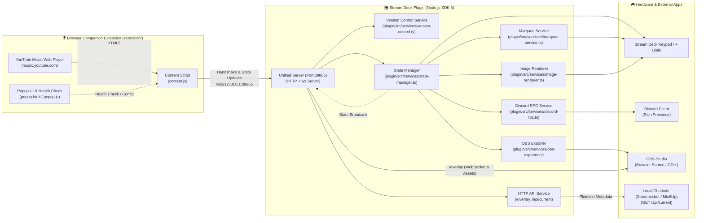
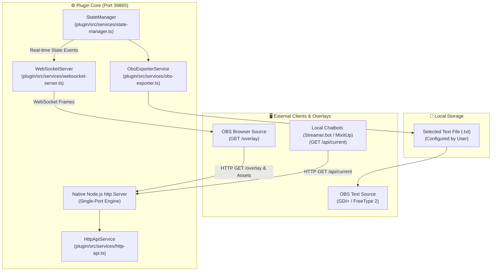

<a id="top"></a>

# System Architecture & Technical Specifications (`docs/architecture.md`)

This document provides an in-depth technical overview of the **YouTube Music Web Controller** monorepo architecture, design principles, and component interactions.

---

## 📑 Table of Contents
- [🏛️ 1. High-Level System Overview](#-1-high-level-system-overview)
- [🧩 2. Core Architectural Principles](#-2-core-architectural-principles)
- [🏗️ 3. Complete Monorepo Structure](#-3-complete-monorepo-structure)
- [🌐 4. Browser Companion Extension Layer (`extension/`)](#-4-browser-companion-extension-layer-extension)
- [🔌 5. Backend Services Layer (`plugin/src/services/`)](#-5-backend-services-layer-pluginsrcservices)
- [🕹️ 6. Action Controllers Layer (`plugin/src/actions/`)](#-6-action-controllers-layer-pluginsrcactions)
- [🎨 7. Property Inspector (PI) Modular Architecture (`plugin/ui/`)](#-7-property-inspector-pi-modular-architecture-pluginui)
- [🔒 8. Version Handshake & Incompatibility Warning Protocol](#-8-version-handshake--incompatibility-warning-protocol)
- [⚡ 9. Stream Deck + Dial & LCD Handling](#-9-stream-deck--dial--lcd-handling)
- [🎥 10. OBS Overlay & Chatbot HTTP Architecture](#-10-obs-overlay--chatbot-http-architecture)

---

## [🏛️ 1. High-Level System Overview](#top)

The project bridges the official [YouTube Music Web App](https://music.youtube.com) and the [Elgato Stream Deck](https://www.elgato.com/stream-deck) hardware using an event-driven, local WebSocket connection with bidirectional version handshake validation.



---

## [🧩 2. Core Architectural Principles](#top)

1. **Zero-Polling (`setInterval == 0`)**:
   - The browser extension never polls the DOM on a periodic interval.
   - All state extractions are reactive, triggered strictly by native HTML5 `<video>` events (`play`, `pause`, `timeupdate`, `seeking`, `seeked`, `ratechange`, `volumechange`) and scoped `MutationObserver` callbacks on music metadata nodes.
   - When music is stopped or paused, CPU and network overhead drop to zero.

2. **Zero Disk Footprint (Standard Mode)**:
   - Dynamic LCD touchstrip layouts, animated dials, and album cover thumbnails are computed entirely in memory (RAM) and encoded as Base64 Data URLs.
   - No temporary cache or image files are ever written to disk (file writes for OBS text export are strictly opt-in).

3. **Single Responsibility Principle (SRP) & Decoupling**:
   - Every system responsibility is encapsulated in an isolated service or component.
   - Action classes do not directly interact with raw sockets or third-party SDKs; they consume backend services via clean Singleton interfaces.

4. **Modular Version Control & Handshake**:
   - Versions are verified bidirectionally upon WebSocket connection before state processing.
   - Version rules, comparisons, and warning strings are centralized in `VersionControlService` with zero hardcoded version literals in action controllers.

---

## [🏗️ 3. Complete Monorepo Structure](#top)

```
ytm-web-controller/
├── version.json                 # Single Source of Truth for project version
├── package.json                 # Monorepo root package configuration & npm scripts
├── AGENTS.md                    # Persistent Developer & AI Agent Guidelines
├── LICENSE                      # MIT License
├── README.md                    # User guide, installation walkthrough & setup documentation
├── scripts/                     # Workspace automation & deployment scripts
│   ├── bump-version.mjs         # Centralized version synchronization script
│   ├── package_plugin.ps1       # Packaging, asset generation & Stream Deck deployment script
│   └── ytm-focus.cs             # Standalone C# source for native Win32 window focus binary
├── docs/                        # Technical specifications & developer documentation
│   ├── ai-disclosure.md         # AI development transparency disclosure
│   ├── architecture.md          # Complete system architecture specification & diagrams
│   ├── configuration.md         # Configuration options & template format guide
│   ├── development.md           # Developer workflow, build & bump commands
│   ├── features.md              # Complete feature matrix & action reference
│   ├── obs-setup.md             # OBS Studio & Chatbot stream setup guide
│   └── plugin-guideline.md      # Elgato Marketplace compliance guidelines
├── screenshots/                 # Preview assets & documentation screenshots
│   ├── Banner.png               # GitHub repository hero banner
│   ├── StreamDeck.png           # Stream Deck action configuration preview
│   ├── OBS-Browser-Overlay.png  # OBS Studio Browser Source overlay preview
│   ├── Discord-Desktop-RPC.png  # Discord Desktop Rich Presence preview
│   └── Discord-Mobile-RPC.png   # Discord Mobile App Rich Presence preview
├── extension/                   # Manifest V3 Browser Companion Extension
│   ├── manifest.json            # MV3 Manifest with sequential MAIN-world scripts & Gecko compatibility
│   ├── background.js            # MV3 service worker for tab and window foreground activation
│   ├── bridge.js                # ISOLATED world bridge for chrome.storage & manifest version
│   ├── utils.js                 # DOM helpers, text/time parsers & in-memory cover canvas processor
│   ├── ytm-actions.js           # Player controls & seek/volume actions
│   ├── ytm-state.js             # High-precision metadata parser, state collector & reactive media observers
│   ├── content.js               # WebSocket client orchestrator, command router & initialization
│   ├── popup.html               # Extension status, version diagnostics & port configuration UI
│   ├── popup.css                # Extension popup dark theme stylesheet
│   ├── popup.js                 # Port storage & live connection diagnostic tester
│   └── icons/                   # Extension toolbar icons (16, 48, 128 px)
├── plugin/                      # Stream Deck Plugin (Node.js SDK 3)
│   ├── manifest.json            # Stream Deck Plugin Manifest (com.smok3y97.ytmusicweb)
│   ├── package.json             # Plugin dependencies & rollup build scripts
│   ├── eslint.config.js         # Official Elgato ESLint flat configuration
│   ├── rollup.config.mjs        # Rollup bundler configuration
│   ├── tsconfig.json            # TypeScript compiler configuration (ES2023)
│   ├── bin/                     # Compiled plugin artifacts
│   │   ├── plugin.js            # Node.js Rollup bundle
│   │   └── ytm-focus.exe        # Native 7 KB Win32 foreground activation binary
│   ├── assets/                  # High-resolution vector & raster assets
│   │   ├── category-icon.svg    # Monochromatic category icon (28x28 / 56x56)
│   │   ├── plugin-icon.png      # Official Full-Color YouTube Music badge (256x256)
│   │   ├── plugin-icon@2x.png   # High-DPI YouTube Music badge (512x512)
│   │   ├── generate_assets.ps1  # Automated asset generator script (PNG & invokes SVG generator)
│   │   ├── generate_official_svgs.mjs # Official SVG vector icons generator
│   │   ├── overlay/             # OBS Studio Browser Source overlay assets (/overlay)
│   │   │   ├── index.html       # Transparent overlay widget DOM structure
│   │   │   ├── style.css        # Responsive frosted dark theme & animation styles
│   │   │   └── overlay.js       # Live WebSocket client & URL parameter parser
│   │   └── actions/             # SVG action icons (playpause, trackdial, volume, etc.)
│   ├── layouts/                 # Stream Deck + Dial LCD JSON layouts
│   │   └── dial_layout.json     # Single-source-of-truth 4-item LCD strip layout
│   ├── ui/                      # Modular Property Inspector (PI) Frontend
│   │   ├── streamdeck-client.js # Low-level Stream Deck WebSocket SDK bridge
│   │   ├── global-settings.js   # Global settings UI component (Discord / OBS / Port)
│   │   ├── common.html          # Standard inspector for stateless/trigger keys
│   │   ├── track-dial.html/.js  # Track Controller Dial inspector
│   │   ├── volume-dial.html/.js # Volume Controller Dial inspector
│   │   ├── seek-dial.html/.js   # Seek Controller Dial inspector
│   │   ├── playpause.html/.js   # Play/Pause inspector (Album cover toggle)
│   │   ├── volume.html/.js      # Volume Up & Down keys inspector
│   │   ├── copy-url.html/.js    # Copy Song URL inspector (Custom format template)
│   │   └── css/sdpi.css         # Stream Deck Property Inspector stylesheet
│   └── src/                     # Backend Source Code (TypeScript)
│       ├── index.ts             # Plugin entry point & action registration
│       ├── types/               # TypeScript interfaces & event payloads
│       ├── services/            # Decoupled backend services layer
│       │   ├── version-control.ts   # Centralized version control & handshake validator
│       │   ├── websocket-server.ts  # Unified Server (Port 39865: HTTP + WebSocket)
│       │   ├── http-api.ts          # Read-only HTTP API & overlay static asset router
│       │   ├── state-manager.ts     # Centralized playback state store
│       │   ├── marquee-service.ts   # Centralized Ping-Pong marquee scroller
│       │   ├── image-renderer.ts    # In-memory RAM base64 canvas renderer
│       │   ├── warning-icons.ts     # Dynamic SVG warning icon generator for mismatch states
│       │   ├── discord-rpc.ts       # Isolated Discord Rich Presence client
│       │   ├── obs-exporter.ts      # Live .txt track info exporter for OBS
│       │   ├── window-focus.ts      # Win32 & OS window focus helper for YouTube Music / PWA
│       │   └── clipboard.ts         # Native clipboard bridge for song URL copying
│       └── actions/             # Independent Action Controllers
│           ├── base-state-action.ts  # Base class for stateful keypad buttons
│           ├── base-volume-action.ts # Base class for volume keypad buttons
│           ├── base-dial-action.ts   # Base class for Stream Deck + dials & LCDs
│           ├── play-pause.ts    # Play / Pause dual-state key handler
│           ├── track-dial.ts    # Track Controller (Dial & LCD)
│           ├── volume-dial.ts   # Volume Controller (Dial & LCD)
│           ├── seek-dial.ts     # Seek Controller (Dial & LCD)
│           ├── volume-up.ts     # Volume Up key
│           ├── volume-down.ts   # Volume Down key
│           ├── mute.ts          # Mute / Unmute toggle key
│           ├── next.ts          # Next Track key
│           ├── previous.ts      # Previous Track key
│           ├── like.ts          # Like Track key
│           ├── dislike.ts       # Dislike Track key
│           ├── shuffle.ts       # Shuffle toggle key
│           ├── repeat.ts        # Repeat mode cycle key
│           └── copy-url.ts      # Copy Song URL key
```

---

## [🌐 4. Browser Companion Extension Layer (`extension/`)](#top)

The browser companion extension runs in the context of `https://music.youtube.com/*` and acts as the bridge between YouTube Music's web player DOM and the local Stream Deck WebSocket server.

### 📄 Modular Component Breakdown:

1. **Manifest Configuration ([`extension/manifest.json`](../extension/manifest.json))**:
   - Built on **Manifest V3**.
   - Fully compatible with **Chromium** and **Gecko** (Mozilla Firefox).
   - Sequentially loads modular scripts in page `"world": "MAIN"` context (`utils.js` → `ytm-actions.js` → `ytm-state.js` → `content.js`) at `document_idle`.

2. **Isolated World Bridge ([`extension/bridge.js`](../extension/bridge.js))**:
   - Injected into `music.youtube.com` with default `ISOLATED` world execution at `document_start`.
   - Bridges manifest version, custom WebSocket port, and version mismatch status bidirectionally to `content.js` via `window.postMessage`.

3. **Core Utilities & Helpers ([`extension/utils.js`](../extension/utils.js))**:
   - Fast DOM query helpers (`$`, `$$`, `clickElement`).
   - `cleanWhitespace`, `isNonAlbumText`, and `parseTimeString` to sanitize multi-lingual YouTube metadata.
   - Robust `extractTrackTiming` prioritizing canonical DOM time strings to avoid MSE chunk buffer truncation.
   - In-memory cover art canvas converter (`processCoverImage`).

4. **Player Actions ([`extension/ytm-actions.js`](../extension/ytm-actions.js))**:
   - Controls for `togglePlayPause`, `setPlayerVolume`, `adjustPlayerVolume`, `togglePlayerMute`, `seekTo`, and `seekRelative`.

5. **State Extraction & Observers ([`extension/ytm-state.js`](../extension/ytm-state.js))**:
   - Zero-polling HTML5 `<video>` listeners (`play`, `pause`, `timeupdate`, `seeking`, `seeked`, `ratechange`, `volumechange`).
   - Scoped `MutationObserver` on player bar elements for immediate state broadcast on track transition.

6. **WebSocket Orchestrator ([`extension/content.js`](../extension/content.js))**:
   - Handles auto-reconnect, bidirectional version handshake, and command dispatching.

---

## [🔌 5. Backend Services Layer (`plugin/src/services/`)](#top)

- **`WebSocketService`**: Hosts local WebSocket & HTTP server on port `39865`. Broadcasts state to connected clients (Stream Deck, OBS overlays).
- **`HttpApiService`**: Serves read-only GET `/overlay` (OBS Browser Source) and GET `/api/current` (Chatbot plaintext metadata).
- **`StateManager`**: Stores active playback state, formatters, and client connectivity status.
- **`MarqueeService`**: Ping-pong bounce scroller for long titles on Stream Deck + LCDs.
- **`ImageRenderer`**: Generates volume bars, mute states, and album thumbnails in RAM.
- **`DiscordRpcService`**: Broadcasts rich presence to Discord Desktop.
- **`ObsExporterService`**: Debounced safe writer for OBS Text (GDI+) file sources (`.txt`).
- **`VersionControlService`**: Dynamic manifest reader and version compatibility validator.

---

## [🕹️ 6. Action Controllers Layer (`plugin/src/actions/`)](#top)

| Action | Class | File |
| :--- | :--- | :--- |
| **Play / Pause** | `PlayPauseAction` | `play-pause.ts` |
| **Track Controller (Dial)** | `TrackDialAction` | `track-dial.ts` |
| **Volume Controller (Dial)** | `VolumeDialAction` | `volume-dial.ts` |
| **Seek Controller (Dial)** | `SeekDialAction` | `seek-dial.ts` |
| **Volume Up / Down** | `VolumeUpAction`, `VolumeDownAction` | `volume-up.ts`, `volume-down.ts` |
| **Mute / Unmute** | `MuteAction` | `mute.ts` |
| **Next / Previous** | `NextAction`, `PreviousAction` | `next.ts`, `previous.ts` |
| **Like / Dislike** | `LikeAction`, `DislikeAction` | `like.ts`, `dislike.ts` |
| **Shuffle / Repeat** | `ShuffleAction`, `RepeatAction` | `shuffle.ts`, `repeat.ts` |
| **Copy Song URL** | `CopyUrlAction` | `copy-url.ts` |

---

## [🔒 8. Version Handshake & Incompatibility Warning Protocol](#top)

1. When the browser extension connects, it sends a `handshake` payload with its manifest version.
2. `VersionControlService` evaluates version compatibility.
3. If incompatible:
   - Keys display dynamic amber warning badges (`⚠️`).
   - Dials show `⚠️ Mismatch` on LCD.
   - Property Inspector reveals top upgrade banner with releases link.
   - Extension popup highlights version requirement card.

---

## [🎥 10. OBS Overlay & Chatbot HTTP Architecture](#top)



### Read-Only Endpoints Reference
| Endpoint | Method | Role & Payload |
| :--- | :--- | :--- |
| `/overlay` | `GET` | Serves the transparent, customizable OBS Browser Source widget. |
| `/api/current` | `GET` | Returns currently playing song info formatted via `?format=...` for chat commands. |
