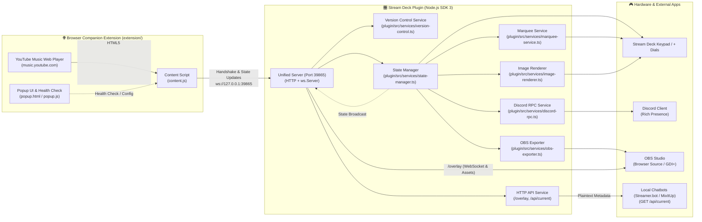
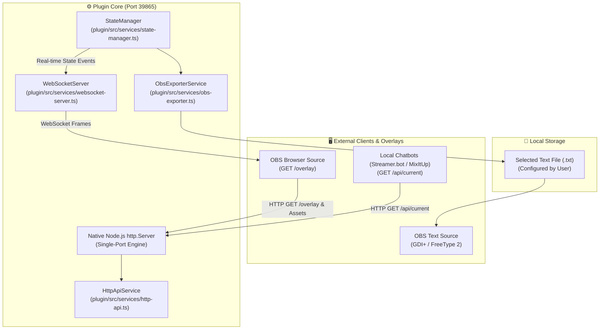
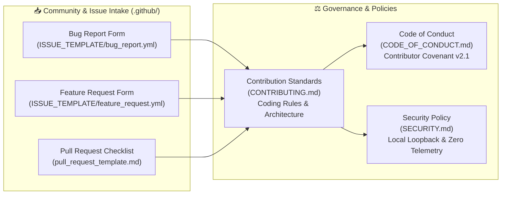

<a id="top"></a>

# System Architecture & Technical Specifications (`docs/architecture.md`)

This document provides an in-depth technical overview of the **Controller for YouTube Music Web** monorepo architecture, design principles, and component interactions.

---

## 📑 Table of Contents
- [🏛️ 1. High-Level System Overview](#-1-high-level-system-overview)
- [🧩 2. Core Architectural Principles](#-2-core-architectural-principles)
- [🏗️ 3. Complete Monorepo Structure](#-3-complete-monorepo-structure)
- [🌐 4. Browser Companion Extension Layer (`extension/`)](#-4-browser-companion-extension-layer-extension)
- [🔌 5. Backend Services Layer (`plugin/src/services/`)](#-5-backend-services-layer-pluginsrcservices)
- [🕹️ 6. Action Controllers Layer (`plugin/src/actions/`)](#-6-action-controllers-layer-pluginsrcactions)
- [🎨 7. Property Inspector (PI) Modular Architecture (`plugin/.../ui/`)](#-7-property-inspector-pi-modular-architecture-pluginui)
- [🔒 8. Version Handshake & Incompatibility Warning Protocol](#-8-version-handshake--incompatibility-warning-protocol)
- [⚡ 9. Stream Deck + Dial & LCD Handling](#-9-stream-deck--dial--lcd-handling)
- [🎥 10. OBS Overlay & Chatbot HTTP Architecture](#-10-obs-overlay--chatbot-http-architecture)
- [🤖 11. CI/CD, Quality Assurance & Release Architecture](#-11-cicd-quality-assurance--release-architecture)
- [📜 12. Community Standards, Security Policy & Governance](#-12-community-standards-security-policy--governance)

---

## [🏛️ 1. High-Level System Overview](#top)

The project bridges the official [YouTube Music Web App](https://music.youtube.com) and the [Elgato Stream Deck](https://www.elgato.com/stream-deck) hardware using an event-driven, local WebSocket connection with bidirectional version handshake validation.


```mermaid
graph LR
    subgraph Browser ["🌐 Browser Companion Extension (extension/)"]
        YTM["YouTube Music Web Player\n(music.youtube.com)"]
        CS["Content Script\n(content.js)"]
        POP["Popup UI & Health Check\n(popup.html / popup.js)"]
        YTM -- "HTML5 <video> Events\n& DOM Mutations" --> CS
        POP -. "Health Check / Config" .-> CS
    end

    subgraph Plugin ["🎛️ Stream Deck Plugin (Node.js SDK 3)"]
        SRV["Unified Server (Port 39865)\n(HTTP + ws.Server)"]
        HTTP["HTTP API Service\n(/overlay, /api/current)"]
        VCS["Version Control Service\n(plugin/src/services/version-control.ts)"]
        SM["State Manager\n(plugin/src/services/state-manager.ts)"]
        MS["Marquee Service\n(plugin/src/services/marquee-service.ts)"]
        IR["Image Renderer\n(plugin/src/services/image-renderer.ts)"]
        DRPC["Discord RPC Service\n(plugin/src/services/discord-rpc.ts)"]
        OBS["OBS Exporter\n(plugin/src/services/obs-exporter.ts)"]
        
        CS -- "Handshake & State Updates\nws://127.0.0.1:39865" --> SRV
        SRV --> HTTP
        SRV --> VCS
        SRV --> SM
        SM --> MS
        SM --> IR
        SM --> DRPC
        SM --> OBS
        SM -. "State Broadcast" .-> SRV
    end

    subgraph Hardware ["🎮 Hardware & External Apps"]
        SD["Stream Deck Keypad / + Dials"]
        DISC["Discord Client\n(Rich Presence)"]
        OBSS["OBS Studio\n(Browser Source / GDI+)"]
        BOT["Local Chatbots (Streamer.bot / MixItUp)\n(GET /api/current)"]
        
        SM --> SD
        MS --> SD
        IR --> SD
        DRPC --> DISC
        OBS --> OBSS
        SRV -- "/overlay (WebSocket & Assets)" --> OBSS
        HTTP -- "Plaintext Metadata" --> BOT
    end
```

### 🔄 End-to-End State Flow

```text
1. Event Trigger:
   YouTube Music Web DOM (<video> status events & MutationObserver for toggles)
2. Extension Extraction:
   ytm-media-session.js (Metadata) + ytm-player-api.js (Timing) ──► ytm-state.js
3. Transport:
   content.js ──► Local WebSocket (ws://127.0.0.1:39865)
4. Plugin Backend:
   websocket-server.ts (Tab arbitration) ──► state-manager.ts (State cache & time interpolation)
5. Distribution Layer:
   ├── Action Controllers (Hardware keys & dials via image-renderer.ts / marquee-service.ts)
   ├── discord-rpc.ts (Desktop Rich Presence)
   ├── obs-exporter.ts (Live .txt file output)
   └── http-api.ts (/overlay OBS widget & /api/current chatbot endpoint)
```

---

## [🧩 2. Core Architectural Principles](#top)

1. **Zero-Polling & Zero-Timeupdate Traffic (`setInterval == 0`)**:
   - The browser extension never polls the DOM on a periodic interval and sends **zero periodic `timeupdate` events** over WebSocket.
   - All state extractions are reactive, triggered strictly by native HTML5 `<video>` status events (`play`, `pause`, `seeking`, `seeked`, `durationchange`, `loadedmetadata`, `ratechange`, `volumechange`) and scoped `MutationObserver` callbacks for like, dislike, shuffle, and repeat states.
   - Playback timing is interpolated locally on client endpoints (Stream Deck LCD dials via `StateManager.getInterpolatedCurrentTime()` and OBS Browser Overlay via `requestAnimationFrame`) using snapshot timestamps, eliminating WebSocket traffic floods during playback.
   - When music is stopped or paused, CPU and network overhead drop to absolute zero.

2. **Zero Disk Footprint & In-Memory Pipeline (Standard Mode)**:
   - Dynamic LCD touchstrip layouts, animated dials, and album cover thumbnails are computed entirely in memory (RAM) and encoded as Base64 Data URLs.
   - The browser extension transmits lightweight cover URLs (`extractArtworkUrl` prioritizing 226×226 px for Stream Deck displays); the Node.js plugin fetches the image directly into a binary RAM `Buffer` with zero intermediate disk writes.
   - No temporary cache or image files are ever written to disk (file writes for OBS text export are strictly opt-in).

3. **Single Responsibility Principle (SRP) & Decoupling**:
   - Every system responsibility is encapsulated in an isolated service or component.
   - Action classes do not directly interact with raw sockets or third-party SDKs; they consume backend services via clean Singleton interfaces.

4. **Modular Version Control & Handshake**:
   - Versions are verified bidirectionally upon WebSocket connection before state processing.
   - Version rules, comparisons, and warning strings are centralized in `VersionControlService` with zero hardcoded version literals in action controllers.

---

## [🏗️ 3. Complete Monorepo Structure](#top)

The repository is structured as a decoupled monorepo separating runtime environments: the Node.js Stream Deck backend, the in-browser extension, automated agent skills, and developer tooling.

### 🏛️ High-Level Monorepo Overview

```text
ytm-web-controller/
├── .agents/                 # Automated Antigravity AI Agent Skills & Tooling
├── .github/                 # GitHub CI/CD workflows, issue templates & PR policies
├── docs/                    # Architectural specifications, feature matrices & developer guides
├── extension/               # Manifest V3 browser companion extension (Chrome, Brave, Edge)
├── plugin/                  # Stream Deck Plugin (Node.js SDK v3, Rollup bundle & Property Inspector)
├── screenshots/             # Visual previews & documentation assets
├── scripts/                 # Workspace build, packaging & version management scripts
├── AGENTS.md                # Persistent directives and non-negotiable guardrails
├── CONTRIBUTING.md          # Community contribution guidelines & coding standards
├── CODE_OF_CONDUCT.md       # Contributor Covenant v2.1 pledge
├── LICENSE                  # MIT License
├── package.json             # Root monorepo configuration & aggregated npm scripts
├── PRIVACY.md               # Extension privacy disclosure
├── README.md                # Public documentation & setup walkthrough
├── SECURITY.md              # Security policies & local-first disclosure
└── version.json             # Single Source of Truth for project version
```

### 🤖 1. Antigravity Agent Skills (`.agents/skills/`)

Automated agent capabilities equipped with specialized executable scripts, JSON schemas/resources, and reference examples:

```text
.agents/skills/
├── changelog-gen/           # Grouped conventional changelog generator
│   ├── SKILL.md             # Execution instructions & editorial guidelines
│   ├── resources/           # commit-conventions.json (SSOT for types, emojis & scopes)
│   ├── scripts/             # generate-changelog.mjs & sync-conventions-doc.mjs
│   └── examples/            # sample-release-notes.md
├── code-audit/              # Read-only architectural & performance auditor
│   ├── SKILL.md             # Quality baseline & audit guidelines
│   ├── resources/           # guardrails-catalog.json (machine-readable constraints)
│   ├── scripts/             # audit-guardrails.mjs (static scanner for AGENTS.md rules)
│   └── examples/            # sample-audit-report.md
├── create-pr/               # Automated branch preparation, commit & PR workflow
│   ├── SKILL.md             # Quality gates & semantic branch rules
│   ├── resources/           # branch-naming-rules.json
│   └── examples/            # pr-template.md
├── docs-review/             # Documentation hygiene & link verification auditor
│   ├── SKILL.md             # Styleguide & syntax hygiene standards
│   ├── resources/           # glossary.json (preferred & forbidden terminology)
│   ├── scripts/             # audit-docs.mjs (link, TOC, buzzword & alert scanner)
│   └── examples/            # sample-docs-audit-report.md
├── generate-assets/         # Asset generator & marketplace compliance auditor
│   ├── SKILL.md             # Dimension & DPI specifications
│   ├── resources/           # asset-specs.json (icon dimensions & touch target rules)
│   ├── scripts/             # validate-assets.mjs (asset presence & layout validator)
│   └── examples/            # sample-icon.svg
├── publish-release/         # 4-digit version release pipeline trigger
│   ├── SKILL.md             # Bump, tag & push instructions
│   ├── resources/           # release-manifest-targets.json (7 synchronized files)
│   └── examples/            # sample-release-workflow.md
└── sync-docs/               # Code-to-documentation synchronization auditor
    ├── SKILL.md             # Documentation tier hierarchy & sync matrix
    ├── resources/           # doc-mapping.json (source-to-docs relationship mapping)
    ├── scripts/             # audit-sync.mjs (version, action UUID & npm script validator)
    └── examples/            # sample-sync-report.md
```

### 🌐 2. Browser Companion Extension Layer (`extension/`)

Runs within `https://music.youtube.com/*` with strict context boundary separation (`MAIN` vs `ISOLATED` World):

```text
extension/
├── manifest.json            # Manifest V3 configuration with sequential MAIN-world scripts
├── background.js            # MV3 service worker for tab foreground activation
├── bridge.js                # ISOLATED World bridge for chrome.storage & manifest version
├── content.js               # WebSocket client orchestrator, command router & lifecycle
├── popup.html/.css/.js      # Toolbar popup UI (status, port configuration & live tester)
├── ytm-actions.js           # Action dispatcher: Playback (MediaSession -> Player API) & UI controls
├── ytm-fallback.js          # UI toggles (Like/Dislike/Shuffle/Repeat) & <video> volume fallbacks
├── ytm-media-session.js     # W3C Media Session API hooks (setActionHandler / metadata)
├── ytm-player-api.js        # YouTube Player API bridge (#movie_player)
├── ytm-selectors.js         # Single Source of Truth for YouTube Music DOM element selectors
├── ytm-state.js             # Reactive HTML5 <video> observer & playback state collector
├── utils.js                 # DOM query helpers, time parsers & artwork URL resolution
└── icons/                   # Extension toolbar & store icons (16, 48, 128 px PNG)
```

### 🎛️ 3. Stream Deck Plugin (`plugin/`)

Node.js SDK v3 backend, compiled Rollup bundle, and modular Property Inspector:

```text
plugin/
├── com.smok3y97.ytmusicweb.sdPlugin/ # Official Elgato distribution directory
│   ├── manifest.json        # Stream Deck Plugin Manifest (com.smok3y97.ytmusicweb)
│   ├── de.json / en.json    # Localized action titles, tooltips & UI strings
│   ├── assets/              # Icons (plugin, category, key states) & OBS overlay web app
│   │   ├── category-icon.svg # Monochromatic action list icon (28×28 / 56×56 px)
│   │   ├── plugin-icon.png  # Brand-compliant circular badge (256×256 / 512×512 px)
│   │   ├── actions/         # SVG action glyphs (white default, red active state)
│   │   └── overlay/         # OBS Studio Browser Source web widget (/overlay)
│   ├── bin/                 # Compiled plugin bundle (plugin.js) & native helper (ytm-focus.exe)
│   ├── layouts/             # Stream Deck + Dial LCD JSON layouts (dial_layout.json)
│   └── ui/                  # Modular Property Inspector (PI) HTML/JS Frontend
│       ├── common.html/.js  # Dynamic inspector for stateless/trigger keypad actions
│       ├── copy-url.html/.js # Copy Song URL inspector with template builder
│       ├── global-settings.js # Shared global settings drawer (Discord / OBS / Port)
│       ├── playpause.html/.js # Play/Pause inspector (Cover background toggle)
│       ├── track-dial.html/.js # Track Controller dial inspector
│       ├── volume-dial.html/.js # Volume Controller dial inspector
│       ├── seek-dial.html/.js # Seek Controller dial inspector
│       └── css/sdpi.css     # Stream Deck Property Inspector stylesheet
├── src/                     # TypeScript Source Code
│   ├── index.ts             # Plugin entry point & action registration
│   ├── types/               # TypeScript interfaces, settings & event payloads
│   ├── services/            # Decoupled backend services layer
│   │   ├── websocket-server.ts  # Unified Server (Port 39865: HTTP + WebSocket)
│   │   ├── http-api.ts          # Read-only HTTP API (/api/current) & overlay asset server
│   │   ├── state-manager.ts     # Playback state caching & progress interpolation
│   │   ├── version-control.ts   # Handshake protocol & incompatibility detection
│   │   ├── tab-manager.ts       # Connected browser tab lifecycle & arbitration
│   │   ├── image-renderer.ts    # In-memory RAM base64 canvas renderer (zero disk I/O)
│   │   ├── marquee-service.ts   # Centralized Ping-Pong text marquee scroller
│   │   ├── template-engine.ts   # Placeholder token replacement engine ({title}, {artist})
│   │   ├── metadata-sanitizer.ts # YouTube Music DOM metadata cleaner
│   │   ├── discord-rpc.ts       # Discord Rich Presence desktop IPC client
│   │   ├── obs-exporter.ts      # Live .txt track info exporter for OBS text sources
│   │   ├── window-focus.ts      # Native Win32 foreground window activation
│   │   └── clipboard.ts         # System clipboard writer for song URLs
│   └── actions/             # Independent Action Controllers
│       ├── base-state-action.ts  # Base class for stateful keypad buttons
│       ├── base-volume-action.ts # Base class for volume keypad buttons
│       ├── base-seek-action.ts   # Base class for seek keypad buttons
│       ├── base-dial-action.ts   # Base class for Stream Deck + dials & LCD touchstrips
│       ├── play-pause.ts    # Play / Pause dynamic key handler (cover & icon)
│       ├── track-dial.ts    # Track Controller (Dial rotation & LCD touch)
│       ├── volume-dial.ts   # Volume Controller (Dial rotation & LCD touch)
│       ├── seek-dial.ts     # Seek Controller (Dial rotation & LCD touch)
│       ├── volume-up.ts / volume-down.ts # Volume stepping keys
│       ├── seek-forward.ts / seek-backward.ts # Track seek stepping keys
│       ├── mute.ts          # Mute / Unmute toggle key
│       ├── next.ts / previous.ts # Track skipping keys
│       ├── like.ts / dislike.ts  # Rating toggle keys
│       ├── shuffle.ts / repeat.ts # Queue mode toggle keys
│       └── copy-url.ts      # Copy Song URL key
├── package.json             # Plugin dependencies & rollup build scripts
├── rollup.config.mjs        # Rollup bundler configuration
├── tsconfig.json            # TypeScript compiler configuration (ES2023)
└── eslint.config.js         # Official Elgato ESLint flat configuration
```

### 📚 4. Documentation, Tooling & Governance (`docs/`, `scripts/`, `.github/`)

Technical specifications, build scripts, and CI/CD pipelines:

```text
├── docs/                    # Technical specifications & developer documentation
│   ├── ai-disclosure.md     # AI development transparency disclosure
│   ├── architecture.md      # Complete system architecture specification & diagrams
│   ├── commit-conventions.md # Conventional Commits guide (rendered from SSOT)
│   ├── configuration.md     # Configuration options & template format guide
│   ├── development.md       # Developer workflow, build & bump commands
│   ├── features.md          # Complete feature matrix & action reference
│   ├── obs-setup.md         # OBS Studio & Chatbot stream setup guide
│   └── plugin-guideline.md  # Elgato Marketplace compliance guidelines
├── scripts/                 # Workspace automation & deployment scripts
│   ├── bump-version.mjs     # Centralized 7-file version synchronization script
│   ├── generate_assets.ps1  # Automated asset generator script (PNG & invokes SVG generator)
│   ├── generate_svgs.mjs    # SVG vector icons generator
│   ├── package_plugin.ps1   # Packaging, asset generation & Stream Deck deployment script
│   └── ytm-focus.cs         # Standalone C# source for native Win32 window focus binary
├── .github/                 # GitHub repository governance & CI/CD workflows
│   ├── dependabot.yml       # Automated weekly dependency scan configuration
│   ├── pull_request_template.md # Standard PR checklist & compliance template
│   ├── workflows/           # Automated GitHub Actions pipelines (ci.yml, release.yml)
│   └── ISSUE_TEMPLATE/      # Structured issue intake forms (bug_report, feature_request)
└── screenshots/             # Hero banners, hardware previews & overlay screenshots
```

---

## [🌐 4. Browser Companion Extension Layer (`extension/`)](#top)

The browser companion extension runs in the context of `https://music.youtube.com/*` and acts as the bridge between YouTube Music's web player DOM and the local Stream Deck WebSocket server.

### 📄 Modular Component Breakdown:

1. **Manifest Configuration ([`extension/manifest.json`](../extension/manifest.json))**:
   - Built on **Manifest V3**.
   - Fully compatible with **Chromium** and **Gecko** (Mozilla Firefox).
   - Sequentially loads modular scripts in page `"world": "MAIN"` context (`ytm-selectors.js` → `ytm-media-session.js` → `utils.js` → `ytm-player-api.js` → `ytm-fallback.js` → `ytm-actions.js` → `ytm-state.js` → `content.js`) at `document_start` to intercept MediaSession handlers before YouTube Music scripts initialize.

2. **ISOLATED World Bridge ([`extension/bridge.js`](../extension/bridge.js))**:
   - Injected into `music.youtube.com` with default `ISOLATED` world execution at `document_start`.
   - Bridges manifest version, custom WebSocket port, and version mismatch status bidirectionally to `content.js` via `window.postMessage`.

3. **Centralized DOM Selectors ([`extension/ytm-selectors.js`](../extension/ytm-selectors.js))**:
   - **Single Source of Truth** for all YouTube Music DOM element selectors (player container, interactive buttons, metadata).
   - Shields the rest of the codebase from UI mutations: when YouTube updates markup or CSS classes, only this single registry requires adjustments.

4. **Tier 1: W3C Media Session API Integration ([`extension/ytm-media-session.js`](../extension/ytm-media-session.js))**:
   - Intercepts `navigator.mediaSession.setActionHandler` at `document_start`.
   - Captures YouTube Music's internal action callbacks (`play`, `pause`, `nexttrack`, `previoustrack`, `seekto`).
   - Extracts official `playbackState` and `metadata` (title, artist, album, artwork).

5. **Core Utilities & Helpers ([`extension/utils.js`](../extension/utils.js))**:
   - Fast DOM query helpers (`$`, `$$`, `clickElement`).
   - Text & time sanitizers (`cleanWhitespace`, `isNonAlbumText`, `parseTimeToSeconds`) to filter multi-lingual YouTube metadata and parse track durations.
   - High-resolution artwork URL extractor (`extractArtworkUrl` preferring `226x226` for Stream Deck keys and touchstrips).

6. **Native Player API ([`extension/ytm-player-api.js`](../extension/ytm-player-api.js))**:
   - Primary playback & seeking controller: executes commands directly through the internal YouTube Music Player API (`#movie_player` / `playerBar.playerApi_`: `playVideo()`, `pauseVideo()`, `nextVideo()`, `previousVideo()`, `setVolume()`, `isMuted()`, `mute()`, `unMute()`, `seekTo()`, `getCurrentTime()`, `getDuration()`).
   - Timing extraction: `getCurrentTime()` directly via Player API with `<video>` fallback; `getDuration()` directly via the authoritative player bar `.time-info` with native API / `<video>` fallback. Avoids MSE streaming buffer truncation issues during track transitions.
   - Zero DOM dependencies for playback controls; unaffected by CSS/HTML changes.

7. **DOM & UI Fallbacks ([`extension/ytm-fallback.js`](../extension/ytm-fallback.js))**:
   - Handles controls not exposed via official JavaScript APIs (Like, Dislike, Shuffle, Repeat) and provides hardware `<video>` volume/mute fallbacks.
   - Strictly references `window.YTM.selectors` for all DOM queries.

8. **Action Orchestrator ([`extension/ytm-actions.js`](../extension/ytm-actions.js))**:
   - **Playback Control**: Tier 1 Media Session API → Tier 2 Native Player API.
   - **Seeking**: Direct native `playerApi.seekTo(target, true)` execution with Media Session fallback for reliable scrubbing.
   - **Volume & Mute**: Native Player API execution coupled with Polymer UI component synchronization (`playerBar.setVolume_`, `tp-yt-paper-slider#volume-slider`, and UI mute button click) so that in-browser icons and sliders stay synchronized with Stream Deck hardware.
   - Triggers staggered state notifications (`notifyState`).

9. **State Extraction & Observers ([`extension/ytm-state.js`](../extension/ytm-state.js))**:
   - Primary metadata extraction via `navigator.mediaSession.metadata` (title, artist, album, artwork).
   - High-precision timing snapshot via `window.YTM.playerApi.getCurrentTime()` and `window.YTM.playerApi.getDuration()`.
   - Event-driven snapshot broadcasting on state transitions (`play`, `pause`, `seeking`, `seeked`, `durationchange`, `loadedmetadata`, `ratechange`, `volumechange`, `ended`) with zero periodic `timeupdate` WebSocket flood.
   - Scoped `MutationObserver` on player bar elements for immediate state broadcast on like, dislike, shuffle, and repeat clicks with clean lifecycle detachment (`teardownGlobalMediaListeners`).

10. **WebSocket Orchestrator ([`extension/content.js`](../extension/content.js))**:
    - Generates unique session `tabId` to participate in multi-tab arbitration.
    - Centralized atomic microtask coalescing (`queueStateSnapshot`) and dirty-checking snapshot dispatcher to eliminate redundant WebSocket frames.
    - Dispatches `TAB_CLOSED` on `beforeunload` and `pagehide` to cleanly deregister tabs and teardown observers.
    - Automatically synchronizes playback state on `visibilitychange` when returning to background tabs.
    - Handles bounded reconnect with passive standby, bidirectional version handshake, and routes Stream Deck commands to `window.YTM.actions`.

### 🌐 Extension Context Boundaries (MAIN vs. ISOLATED World)

- **MAIN World (`extension/ytm-*.js`, `extension/content.js`):** Interacts directly with the YouTube Music DOM, Polymer UI components, and the `#movie_player` API. It has **zero direct access** to Chrome Extension runtime APIs (`chrome.storage`, `chrome.runtime`).
- **ISOLATED World (`extension/bridge.js`):** Bridges manifest metadata and stored port configurations from `chrome.storage.local`. It communicates with the MAIN World exclusively via bidirectional `window.postMessage`.
- **Strict Boundary Rule:** Never attempt to call `chrome.*` APIs inside MAIN World scripts, and never query YouTube player internals or the DOM directly inside `bridge.js`.

---

## [🔌 5. Backend Services Layer (`plugin/src/services/`)](#top)

- **`WebSocketService`**: Hosts local WebSocket & HTTP server on configurable port (default `39865`).
  - **CSWSH Origin Security (`verifyClient`)**: Strictly validates incoming connection origins (`https://music.youtube.com`, `http://127.0.0.1:${port}`, `http://localhost:${port}`, `chrome-extension://*`, `moz-extension://*`, and local tools), rejecting unauthorized web origins with HTTP 403.
  - **Broadcast State**: Dispatches state updates to all connected external listeners (e.g. OBS overlay).
- **`TabManager`**: Decoupled multi-tab arbitration and client registry.
  - **Multi-Tab Orchestration**: Tracks connected tabs by `tabId` and active playback state. Automatically routes hardware commands exclusively to the tab actively playing audio (`!isPaused`), preventing ghost commands to idle tabs and ignoring stale pause events from background tabs.
  - **Version Mismatch Evaluation**: Centralizes version compatibility state across active non-overlay tabs.
- **`HttpApiService`**: Serves read-only GET `/overlay` (OBS Browser Source) with in-memory caching of HTML, CSS, and JS assets, and GET `/api/current` (Chatbot plaintext metadata).
- **`StateManager`**: Stores active playback state, performs local timestamp-based time interpolation (`getInterpolatedCurrentTime()`), and manages state change lifecycle events.
- **`TemplateEngine`**: Isolated placeholder formatting engine for Track Titles, Times, Formatted Tracks, Volume readouts, and Seek button labels across keypad buttons and LCD touchstrips.
- **`MetadataSanitizer`**: Multi-language DOM metadata filtering engine that strips out non-album tokens (view counts, upload timestamps, release years, like counts) across internationalized YouTube Music interfaces. Pattern semantics are kept in parity with `extension/utils.js` (e.g. state-free `REGEX_TRAILING_YEAR` without global flag).
- **`MarqueeService`**: Ping-pong bounce scroller for long titles on Stream Deck + LCDs, featuring LRU eviction and CJK full-width character detection for accurate LCD text width estimation.
- **`ImageRenderer`**: Generates volume bars, mute states, and fetches cover art into RAM buffers as Base64 Data URLs with bounded in-RAM LRU overlay caching.
- **`DiscordRpcService`**: Broadcasts rich presence to Discord Desktop with timeline calculations anchored to the state snapshot timestamp, eliminating debounce drift.
- **`ObsExporterService`**: Debounced safe writer for OBS Text (GDI+) file sources (`.txt`).
- **`VersionControlService`**: Dynamic manifest reader and version compatibility validator.
- **`DialRotaryStreamer`**: Decoupled hardware rotary stream controller encapsulating encoder tick accumulation, push-jitter suppression (250ms), 10-Hz optimistic feedback rate limiting (100ms), continuous rotation streaming, and trailing settle timers (110ms) across all Stream Deck + dial actions.

---

## [🕹️ 6. Action Controllers Layer (`plugin/src/actions/`)](#top)

| Action | Class | File |
| :--- | :--- | :--- |
| **Play / Pause** | `PlayPauseAction` | `play-pause.ts` |
| **Track Controller (Dial)** | `TrackDialAction` | `track-dial.ts` |
| **Volume Controller (Dial)** | `VolumeDialAction` | `volume-dial.ts` |
| **Seek Controller (Dial)** | `SeekDialAction` | `seek-dial.ts` |
| **Volume Up / Down** | `VolumeUpAction`, `VolumeDownAction` (via `BaseVolumeAction` & `BaseKeypadTemplateAction`) | `volume-up.ts`, `volume-down.ts` |
| **Fast Forward / Rewind** | `SeekForwardAction`, `SeekBackwardAction` (via `BaseSeekAction` & `BaseKeypadTemplateAction`) | `seek-forward.ts`, `seek-backward.ts` |
| **Mute / Unmute** | `MuteAction` | `mute.ts` |
| **Next / Previous** | `NextAction`, `PreviousAction` | `next.ts`, `previous.ts` |
| **Like / Dislike** | `LikeAction`, `DislikeAction` | `like.ts`, `dislike.ts` |
| **Shuffle / Repeat** | `ShuffleAction`, `RepeatAction` | `shuffle.ts`, `repeat.ts` |
| **Copy Song URL** | `CopyUrlAction` | `copy-url.ts` |

---

## [🎨 7. Property Inspector (PI) Modular Architecture (`plugin/.../ui/`)](#top)

The Property Inspector frontend uses a modular architecture with centralized internationalization:

```
┌─────────────────────────────────────────────────────────────┐
│                 Property Inspector Frontend                 │
│                                                             │
│  ┌───────────────────────┐       ┌───────────────────────┐  │
│  │   streamdeck-client   │       │     i18n.js Loader    │  │
│  │  (WebSocket SDK Bridge│ ◄───► │ (Loads de.json/en.json│  │
│  │  & App Language Parser│       │  & DOM Auto-Translate │  │
│  └───────────┬───────────┘       └───────────┬───────────┘  │
│              │                               │              │
│  ┌───────────▼───────────┐       ┌───────────▼───────────┐  │
│  │   global-settings.js  │       │  Action Specific HTML │  │
│  │  (Discord / OBS / Port│       │ (common, playpause,   │  │
│  │   Auto-Save Settings) │       │  dials, volume, etc.) │  │
│  └───────────────────────┘       └───────────────────────┘  │
└─────────────────────────────────────────────────────────────┘
```

1. **Centralized Localization Single Source of Truth**:
   - All translation strings, labels, hints, and dynamic descriptions are stored under `"Localization"` in [`plugin/com.smok3y97.ytmusicweb.sdPlugin/en.json`](../plugin/com.smok3y97.ytmusicweb.sdPlugin/en.json) (Default English) and [`plugin/com.smok3y97.ytmusicweb.sdPlugin/de.json`](../plugin/com.smok3y97.ytmusicweb.sdPlugin/de.json) (German).
   - Zero duplication: `i18n.js` contains no hardcoded strings and dynamically loads the JSON files at runtime.
2. **Automatic Language Resolution & Fallback**:
   - `StreamDeckClient` extracts the active Stream Deck language (`application.language`) on socket connection and initializes `I18n`.
   - `I18n` scans the DOM for `data-i18n`, `data-i18n-placeholder`, and `data-i18n-title` attributes. If a translation key is missing or undefined in a non-English locale, it automatically falls back to English.
3. **Dynamic Action Descriptions**:
   - [`common.js`](../plugin/com.smok3y97.ytmusicweb.sdPlugin/ui/common.js) inspects the active `actionInfo.action` UUID and renders a concise, action-specific description.
4. **Auto-Save**:
   - All settings automatically sync on `change` / `input` events via `StreamDeckClient.saveLocalSettings()` and `StreamDeckClient.saveGlobalSettings()`. No manual save buttons.

---

## [🔒 8. Version Handshake & Incompatibility Warning Protocol](#top)

1. When the browser extension connects, it sends a `handshake` payload with its manifest version.
2. `VersionControlService` evaluates version compatibility.
3. If incompatible:
   - Keys display dynamic amber warning badges (`⚠️`).
   - Dials show `⚠️ Mismatch` on LCD.
   - Property Inspector reveals top upgrade banner with releases link.
   - Extension popup highlights version requirement card.

---

## [⚡ 9. Stream Deck + Dial & LCD Handling](#top)

The Stream Deck + integration combines physical rotary encoders with high-density LCD touchstrips (`200 × 100 px` per dial slot).

### 🎛️ Touchstrip Layout & Visual Pipeline
- **Layout Definition (`layouts/dial_layout.json`)**: Single Source of Truth 4-item LCD layout rendering track artwork/title, artist/album, volume level/progress bar, and playback state icon.
- **In-Memory Rendering Pipeline & Memoization**: Dynamic canvas drawings, SVG generation, and album cover processing are executed entirely in RAM (`ImageRenderer`) and output as Base64 Data URLs with zero intermediate disk writes. Bounded in-RAM caches (`overlayCache` in `ImageRenderer` and `warningIconCache` in `warning-icons.ts`) eliminate duplicate SVG string templates and URI encoding allocations across render and marquee ticks.
- **Hardware Refresh Limit & Settings Caching**: Programmatic LCD touchstrip renders and key updates must not exceed **10 updates per second (10 Hz)** to avoid USB bus congestion and Stream Deck firmware latency. Dial actions cache Property Inspector settings in `actionSettings` maps on `onWillAppear` and `onDidReceiveSettings`, completely eliminating IPC `getSettings()` round-trips during render loops and marquee ticks. `updateAllDials` is debounced by 30ms to coalesce rapid state change events.

### 🔄 10-Hz Dial Rotary Streaming & Settle Lifecycle (`DialRotaryStreamer`)
- **Zero-Latency First Detent**: The first rotation detent fires immediately with 0ms latency if the dial was idle ($\ge 100\text{ ms}$ since the previous command dispatch).
- **Active 10-Hz Streaming**: Continuous rotary encoder spinning spins up an active 100ms interval timer via `DialRotaryStreamer`. Accumulated rotation ticks are batched and dispatched at the exact 10-Hz boundary, preventing USB bus flooding or dropped ticks.
- **Optimistic Target Tracking**: During active rotation, the controller tracks optimistic targets (`lastTargetVolume` / `lastTargetSeconds`). Subsequent ticks increment from the tracked optimistic position rather than stale `StateManager` values pending WebSocket round-trip acknowledgments, preventing dial rubber-banding or display flicker.
- **Trailing Settle Debounce**: A 110ms trailing debounce timer fires after rotary movement stops, flushing any final residual ticks, clearing the 10-Hz stream interval, and resetting the optimistic tracking state without redundant `setFeedback` calls if the LCD is already synchronized.

### ⏱️ Client-Side Time Interpolation
- YouTube Music does not push continuous WebSocket timestamp ticks during playback (Zero Polling / Zero `timeupdate` over WS).
- The plugin interpolates current playback time client-side via `StateManager.getInterpolatedCurrentTime()`:
  $$\text{CurrentTime} = \min\left(\text{Duration}, \text{SnapshotTime} + \frac{(\text{Date.now}() - \text{SnapshotTimestamp}) \times \text{PlaybackRate}}{1000}\right)$$
- If the track is paused (`isPaused === true`), the time remains frozen at `SnapshotTime`.

### 🔊 Volume Clamping & Step Normalization
- YouTube Music treats player volume strictly as an integer between `0` and `100`.
- Dial rotation ticks (typically configured at $\pm 2\%$ or $\pm 5\%$) calculate the delta and must clamp the resulting value strictly to `[0, 100]` before dispatching over WebSocket.

---

## [🎥 10. OBS Overlay & Chatbot HTTP Architecture](#top)


```mermaid
graph TD
    subgraph ClientLayer ["🖥️ External Clients & Overlays"]
        OBS_BROWSER["OBS Browser Source\n(GET /overlay)"]
        CHATBOT["Local Chatbots (Streamer.bot / MixItUp)\n(GET /api/current)"]
        OBS_TEXT["OBS Text Source\n(GDI+ / FreeType 2)"]
    end

    subgraph ServerLayer ["⚙️ Plugin Core (Port 39865)"]
        HTTP_SRV["Native Node.js http.Server\n(Single-Port Engine)"]
        API["HttpApiService\n(plugin/src/services/http-api.ts)"]
        WS["WebSocketServer\n(plugin/src/services/websocket-server.ts)"]
        OBS_SVC["ObsExporterService\n(plugin/src/services/obs-exporter.ts)"]
        STATE["StateManager\n(plugin/src/services/state-manager.ts)"]
    end

    subgraph StorageLayer ["💾 Local Storage"]
        TXT_FILE["Selected Text File (.txt)\n(Configured by User)"]
    end

    OBS_BROWSER -- "HTTP GET /overlay & Assets" --> HTTP_SRV
    CHATBOT -- "HTTP GET /api/current" --> HTTP_SRV
    
    HTTP_SRV --> API
    
    STATE --> OBS_SVC
    OBS_SVC --> TXT_FILE
    TXT_FILE --> OBS_TEXT
    
    STATE -- "Real-time State Events" --> WS
    WS -- "WebSocket Frames" --> OBS_BROWSER
```

### Read-Only Endpoints Reference
| Endpoint | Method | Role & Payload |
| :--- | :--- | :--- |
| `/overlay` | `GET` | Serves the transparent, customizable OBS Browser Source widget. |
| `/api/current` | `GET` | Returns currently playing song info formatted via `?format=...` for chat commands. |

---

## [🤖 11. CI/CD, Quality Assurance & Release Architecture](#top)

The repository integrates an automated continuous quality assurance and release distribution pipeline utilizing **GitHub Actions**, **Dependabot**, and the official **Elgato Stream Deck CLI**.


```mermaid
graph TD
    subgraph Triggers ["🚀 Automation Triggers"]
        PUSH["Git Push / PR (main, master)"]
        TAG["Git Tag Push (v*.*.*.*)"]
        DEP["Weekly Dependabot Scan"]
        DISPATCH["Manual Workflow Dispatch"]
    end

    subgraph CI ["🛡️ CI Pipeline (.github/workflows/ci.yml)"]
        ENV["Setup Node.js 24\n(cache: plugin/package-lock.json)"]
        LINT["Lint & Typecheck\n(tsc --noEmit && eslint)"]
        PACK["Staging & Packaging\n(scripts/package_plugin.ps1)"]
        VAL["Official Elgato Schema Validation\n(streamdeck validate)"]
        ART["Upload Test Artifacts\n(.streamDeckPlugin & extension.zip)"]
        
        ENV --> LINT --> PACK --> VAL --> ART
    end

    subgraph ReleasePipeline ["📦 Release Pipeline (.github/workflows/release.yml)"]
        RENV["Setup Node.js 24 Environment"]
        RLINT["Full Typecheck, Lint & Build"]
        RPACK["Staging & Production Packaging"]
        RVAL["Elgato CLI Schema Validation"]
        PUB["Publish GitHub Release\n(softprops/action-gh-release@v3)"]
        ASSETS["Attach Binaries:\n1. com.smok3y97.ytmusicweb.streamDeckPlugin\n2. extension.zip"]
        
        RENV --> RLINT --> RPACK --> RVAL --> PUB --> ASSETS
    end

    PUSH --> CI
    DEP --> CI
    TAG --> ReleasePipeline
    DISPATCH --> ReleasePipeline
```

### Pipeline Guarantees
1. **Zero Broken Releases**: Every release is strictly gatekept by `npm run lint` and `streamdeck validate` before publication.
2. **Deterministic Monorepo Builds**: Build caches explicitly resolve to `plugin/package-lock.json` and Node.js 24.
3. **Automated Dual-Asset Distribution**: Both distribution packages (`.streamDeckPlugin` and `extension.zip`) are synchronized and uploaded simultaneously.

---

## [📜 12. Community Standards, Security Policy & Governance](#top)

The repository adheres to open-source governance and security standards:


```mermaid
graph LR
    subgraph Intake ["📥 Community & Issue Intake (.github/)"]
        BUG["Bug Report Form\n(ISSUE_TEMPLATE/bug_report.yml)"]
        FEAT["Feature Request Form\n(ISSUE_TEMPLATE/feature_request.yml)"]
        PRT["Pull Request Checklist\n(pull_request_template.md)"]
    end

    subgraph Governance ["⚖️ Governance & Policies"]
        COC["Code of Conduct\n(CODE_OF_CONDUCT.md)\nContributor Covenant v2.1"]
        SEC["Security Policy\n(SECURITY.md)\nLocal Loopback & Zero Telemetry"]
        CONTRIB["Contribution Standards\n(CONTRIBUTING.md)\nCoding Rules & Architecture"]
    end

    BUG --> CONTRIB
    FEAT --> CONTRIB
    PRT --> CONTRIB
    CONTRIB --> COC
    CONTRIB --> SEC
```

1. **Security Architecture (`SECURITY.md`)**:
   - Explicitly documents the local-only loopback architecture (`127.0.0.1:39865`).
   - Guarantees zero collection or transmission of user telemetry, passwords, or credentials.
   - Provides private coordinated vulnerability reporting via GitHub Advisories.
2. **Contributor Covenant (`CODE_OF_CONDUCT.md`)**:
   - Adopts version 2.1 of the Contributor Covenant standard for community moderation and inclusivity.
3. **Structured Issue Intake (`.github/ISSUE_TEMPLATE/`)**:
   - Captures environment data (OS, Browser, Stream Deck model, and logs) upfront for faster triaging.

