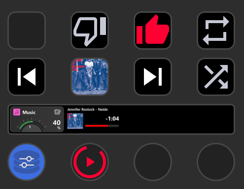
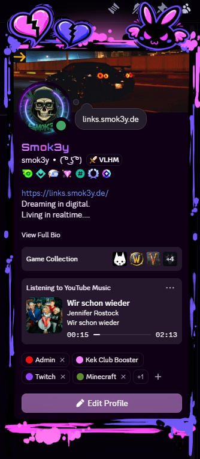
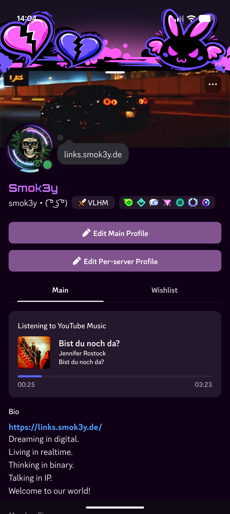

# Feature Matrix & Action Reference (`docs/features.md`)

This document provides a comprehensive technical breakdown of all available actions, hardware controllers, dynamic visual feedbacks, and background integrations in **YouTube Music Web Controller**.

---

## 📑 Table of Contents
- [🎛️ Stream Deck + Dials & LCD Touchstrips](#-stream-deck--dials--lcd-touchstrips)
- [🔘 Keypad Actions](#-keypad-actions)
- [📡 Integrations & Background Services](#-integrations--background-services)
- [🖼️ Hardware & Integration Previews](#-hardware--integration-previews)

---

## [🎛️ Stream Deck + Dials & LCD Touchstrips](#top)

Stream Deck + provides 4 continuous dials with integrated push buttons and a capacitive color LCD touchstrip (`200 × 100 px` per dial slot).

| Action | Control Type | Hardware Feedback | Description |
| :--- | :--- | :--- | :--- |
| **Track Controller** | Dial + LCD Tap | Auto-scrolling title/artist marquee, cover thumbnail, live time & track progress bar | Rotate to skip tracks (Next / Previous). Push dial or tap LCD touchstrip to toggle Play/Pause. Includes push-jitter suppression. |
| **Volume Controller** | Dial + LCD Tap | Real-time volume bar, percentage readout (`100%`, `MUTED`), cover thumbnail | Rotate to adjust volume (1% – 50% step, via range slider). Push dial or tap LCD touchstrip to toggle Mute / Unmute. |
| **Seek Controller** | Dial + LCD Tap | Real-time track progress bar, `{current} / {duration}` time display, cover thumbnail | Rotate to scrub forward/backward in track (1s – 120s step, via range slider, default 10s). Push dial or tap LCD touchstrip to toggle Play/Pause. |

---

## [🔘 Keypad Actions](#top)

Standard 72×72 px Stream Deck keys supporting dual-state, tri-state, single-action, dynamic vector rendering, and in-memory album art background drawing.

| Action | Key Type | Dynamic Feedback | Description |
| :--- | :--- | :--- | :--- |
| **Play / Pause** | Dual-State | Dynamic Play/Pause vector state or live **Album Cover Art as button background** | Toggles playback state on short press. Long press (hold) brings the YouTube Music browser tab or PWA window to the foreground. Cover art is rendered directly in RAM with zero disk I/O. |
| **Volume Up** | Single Key | Live `{volume}%` text readout | Increases playback volume by configurable step (1% – 50%). Fully stylable via native Title Styler. |
| **Volume Down** | Single Key | Live `{volume}%` text readout | Decreases playback volume by configurable step (1% – 50%). Fully stylable via native Title Styler. |
| **Mute / Unmute** | Dual-State | Dynamic Unmuted / Muted speaker icons | Toggles mute status for active playback. |
| **Next Track** | Single Key | Official vector Next icon | Skips to the next track in current queue. |
| **Previous Track** | Single Key | Official vector Previous icon | Skips to previous track or restarts current track. |
| **Like Track** | Dual-State | Dynamic active/inactive thumbs-up highlight (`#FF0033`) | Toggles like rating on current song. |
| **Dislike Track** | Dual-State | Dynamic active/inactive thumbs-down highlight (`#FF0033`) | Toggles dislike rating on current song. |
| **Shuffle** | Dual-State | Dynamic active/inactive shuffle highlight (`#FF0033`) | Toggles queue shuffle mode on/off. |
| **Repeat Mode** | Tri-State | Dynamic cycle icons: **Off** ➔ **All** ➔ **One (1)** | Cycles playlist repeat modes. |
| **Copy Song URL** | Single Key | Visual checkmark confirmation on key | Copies current track URL or custom formatted track info (`{url}`, `{title}`, `{artist}`, `{album}`) directly to clipboard. |

---

## [📡 Integrations & Background Services](#top)

Background services run locally inside the Stream Deck plugin process on port `39865` with zero external dependencies or open firewall ports.

| Feature | Target App | Key Capabilities |
| :--- | :--- | :--- |
| **Discord Rich Presence (RPC)** | Discord Desktop & Mobile | Real-time status, album art, and animated timeline progress across Desktop & Mobile (interactive clickable song buttons available on Discord Desktop client). |
| **OBS Browser Overlay** | OBS Studio / Streamlabs | Real-time interactive browser source widget (`http://localhost:39865/overlay`) with themes (`card`, `compact`, `pill`), visual styling engine, live album art, and smooth animations. |
| **Chatbot API (`!song`)** | Streamer.bot / MixItUp / Local Bots | Instant read-only HTTP endpoint for current song info (`http://localhost:39865/api/current`) with customizable placeholders (`{artist}`, `{title}`, `{album}`, `{url}`). |
| **OBS Text Export (.txt)** | OBS Studio / Streamlabs | Automatically writes live track metadata (`{artist}`, `{title}`, `{album}`) to a selected `.txt` file for OBS Text (GDI+) overlay sources. Requires selecting target file on activation; optional clear-on-pause. |
| **Internationalization (i18n)** | Stream Deck & Property Inspector | Built-in localization support for **English (Default)** and **German (`de`)**. All action names, tooltips, encoder descriptions, and Property Inspector settings adapt automatically to the Stream Deck language. |

---

## [🖼️ Hardware & Integration Previews](#top)

### 🎛️ Stream Deck Action Setup Preview

  
   
  <em>Stream Deck Plugin Action Setup & Dynamic Key / Dial Configuration</em>

### 💬 Discord Rich Presence Preview

<table align="center">
  <tr>
    <th align="center">🖥️ Discord Desktop Rich Presence</th>
    <th align="center">📱 Discord Mobile App Rich Presence</th>
  </tr>
  <tr>
    <td align="center" valign="middle">
      
    </td>
    <td align="center" valign="middle">
      
    </td>
  </tr>
</table>
