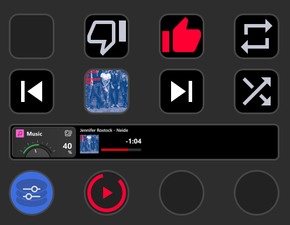
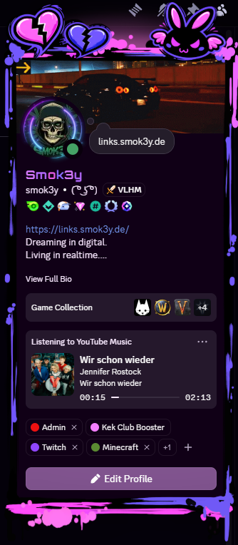
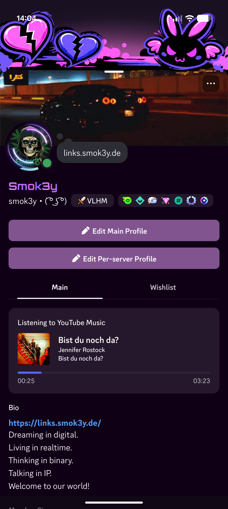

# Feature Matrix & Action Reference (`docs/features.md`)

This document describes all buttons, dials, visual feedback states, and streaming integrations available in **Controller for YouTube Music Web**.

---

## 📑 Table of Contents
- [🎛️ Stream Deck + Dials & LCD Touchstrips](#-stream-deck--dials--lcd-touchstrips)
- [🔘 Keypad Actions](#-keypad-actions)
- [📡 Integrations & Background Services](#-integrations--background-services)
- [🖼️ Hardware & Integration Previews](#-hardware--integration-previews)

---

## [🎛️ Stream Deck + Dials & LCD Touchstrips](#top)

Stream Deck + features 4 rotary dials with push buttons and an interactive color LCD touchstrip screen.

| Action | Control Type | Visual Feedback | Description |
| :--- | :--- | :--- | :--- |
| **Track Controller** | Dial + LCD Tap | Auto-scrolling song/artist marquee, cover thumbnail, live time & track progress bar | Rotate to skip tracks (Next / Previous). Push dial or tap LCD screen to toggle Play/Pause. Includes accidental turn protection when pressing down. |
| **Volume Controller** | Dial + LCD Tap | Real-time volume bar, percentage readout (`100%`, `MUTED`), cover thumbnail | Rotate to adjust volume (1% – 50% step via slider). Push dial or tap LCD screen to toggle Mute / Unmute. |
| **Seek Controller** | Dial + LCD Tap | Real-time track progress bar, `{current} / {duration}` time display, cover thumbnail | Rotate to jump forward or backward in track (1s – 120s step via slider, default 10s). Push dial or tap LCD screen to toggle Play/Pause. |

---

## [🔘 Keypad Actions](#top)

Interactive buttons for standard Stream Deck keys (Stream Deck MK.2, Mini, XL, and Neo) with live album art backgrounds, crisp status icons, and real-time text displays.

| Action | Button Type | Visual Feedback | Description |
| :--- | :--- | :--- | :--- |
| **Play / Pause** | Button | Live Play/Pause icon, album art background, or song info readout | Short press toggles Play/Pause. Long press brings the YouTube Music window or tab to the front. Album cover is drawn directly without creating temporary files, with optional text overlay. |
| **Volume Up** | Button | Live `{volume}%` text display | Increases playback volume by configurable step (1% – 50%). Stylable via Stream Deck Title Styler. |
| **Volume Down** | Button | Live `{volume}%` text display | Decreases playback volume by configurable step (1% – 50%). Stylable via Stream Deck Title Styler. |
| **Mute / Unmute** | Toggle Button | Muted / Unmuted speaker icons | Toggles mute on or off for active music playback. |
| **Next Track** | Button | Next track icon | Skips to the next song in your queue. |
| **Previous Track** | Button | Previous track icon | Skips to previous song or restarts current track. |
| **Like Track** | Toggle Button | Highlights red when liked | Toggles like rating on the current song. |
| **Dislike Track** | Toggle Button | Highlights red when disliked | Toggles dislike rating on the current song. |
| **Shuffle** | Toggle Button | Highlights red when shuffle is on | Toggles playlist shuffle mode on or off. |
| **Repeat Mode** | Cycle Button | Cycles icons: **Off** ➔ **All** ➔ **One (1)** | Cycles through playlist repeat modes. |
| **Fast Forward** | Button | Live `+{step}s` text display | Fast forwards playback by configurable seconds (5s – 120s, default 10s). Stylable via Title Styler. |
| **Rewind** | Button | Live `-{step}s` text display | Rewinds playback by configurable seconds (5s – 120s, default 10s). Stylable via Title Styler. |
| **Copy Song URL** | Button | Green checkmark confirmation | Copies the current track link or custom formatted song text directly to your clipboard. |

---

## [📡 Integrations & Background Services](#top)

These features run 100% locally on your PC inside the Stream Deck plugin without external servers or cloud accounts.

| Feature | Target App | What It Does |
| :--- | :--- | :--- |
| **Discord Rich Presence (RPC)** | Discord Desktop & Mobile | Shows live song title, artist, album art, and animated timeline progress in your Discord status. |
| **OBS Browser Overlay** | OBS Studio / Streamlabs | Animated stream overlay (`http://localhost:39865/overlay`) with themes (`card`, `compact`, `pill`), custom colors, live album art, and smooth 60-FPS progress bar. |
| **Chatbot API (`!song`)** | Streamer.bot / MixItUp / Local Bots | Local web address for current song info (`http://localhost:39865/api/current`) for Twitch and YouTube chat bots with customizable format templates. |
| **OBS Text Export (.txt)** | OBS Studio / Streamlabs | Automatically writes live song info to a selected `.txt` file for classic OBS text sources. Optional auto-clear on pause. |
| **Internationalization (i18n)** | Stream Deck & Property Inspector | Built-in support for **English (Default)** and **German (`de`)**. All button names, descriptions, and settings adapt automatically to your Stream Deck language. |

---

## [🖼️ Hardware & Integration Previews](#top)

### 🎛️ Stream Deck Action Setup Preview

  
   
  <em>Stream Deck Plugin Action Setup & Dynamic Key / Dial Configuration</em>

### 💬 Discord Rich Presence Preview

<table align="center">
  <tr>
    <th align="center">🖥️ Discord Desktop Rich Presence</th>
    <th align="center">📱 Discord Mobile App Rich Presence</th>
  </tr>
  <tr>
    <td align="center" valign="middle">
      
    </td>
    <td align="center" valign="middle">
      
    </td>
  </tr>
</table>
