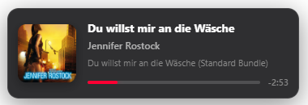

<a id="top"></a>

# OBS Studio & Chatbot Setup Guide (`docs/obs-setup.md`)

This guide explains how to integrate live YouTube Music track metadata into your OBS Studio stream setup and connect Twitch/YouTube/Kick chat bots.

---

## 📑 Table of Contents
- [🚀 Overview of Available Methods](#-overview-of-available-methods)
- [🌐 Streamer Studio Web Dashboard (`/dashboard`)](#-streamer-studio-web-dashboard-dashboard)
- [🎨 Method 1: Interactive OBS Browser Source Overlay](#-method-1-interactive-obs-browser-source-overlay)
- [🤖 Method 2: Chatbot Current Song Command (`!song`)](#-method-2-chatbot-current-song-command-song)
- [🎶 Method 3: Viewer Song Requests (`!playnext`)](#-method-3-viewer-song-requests-playnext)
- [📄 Method 4: Classic OBS Text File Export (.txt)](#-method-4-classic-obs-text-file-export-txt)
- [❓ Troubleshooting & Tips](#-troubleshooting--tips)

---

## [🚀 Overview of Available Methods](#top)

| Method | Best For | Features |
| :--- | :--- | :--- |
| **Streamer Studio Dashboard** *(Recommended)* | Complete visual control & live preview | Real-time OBS overlay configurator with live preview, song blacklist manager, chatbot commands, and settings synchronization. Accessible at `http://localhost:39865/dashboard`. |
| **Method 1: Browser Source Overlay** | Modern, dynamic animated stream widgets | Live album art, ping-pong title scroll, animated progress bar, themes, HEX colors, and transparency. |
| **Method 2: Chatbot Metadata API (`!song`)** | Twitch/YouTube chat commands | Instant plaintext HTTP endpoint, customizable placeholders, zero bot latency. |
| **Method 3: Chatbot Song Requests (`!playnext`)** | Viewer song requests & Twitch Channel Points | Non-interruptive queueing, blacklist protection, custom feedback templates, and Stream Deck toggle. |
| **Method 4: Text File Export (`.txt`)** | Classic GDI+ text sources & marquee filters | File-based output for native OBS Text sources (`ytm_current_track.txt`). |

> [!NOTE]
> All HTTP features (Dashboard, Overlay, API routes) are enabled when **Enable Streamer Tools & Web Server** is checked in the Stream Deck Property Inspector.

---

## [🌐 Streamer Studio Web Dashboard (`/dashboard`)](#top)

The built-in Web Dashboard provides an all-in-one 3-column control center for streamers and creators:

1. In Stream Deck, open any YouTube Music key settings and ensure **Enable Streamer Tools & Web Server** is checked.
2. Click **🌐 Open Streamer Dashboard** or navigate to `http://localhost:39865/dashboard` in your browser.
3. The dashboard features:
   - **Column 1 (Customizer & Chatbots)**: Live theme selector, color pickers, opacity slider, dimension controls, and vertically stacked chatbot commands with 1-click Copy buttons.
   - **Column 2 (Live Preview & Blacklist)**: Real-time widget preview, quick track actions (`↗ Open Track`, `⛔ Blacklist & Skip`), and searchable `blacklist.txt` table.
   - **Column 3 (Settings & Documentation)**: Two-way settings synchronization form and interactive setup reference with GitHub Wiki links.

---

## [🎨 Method 1: Interactive OBS Browser Source Overlay](#top)

Add an animated now-playing music widget directly to OBS Studio as a **Browser Source**.

### 🚀 Step-by-Step Setup in OBS Studio:
1. Open **OBS Studio**.
2. Under **Sources**, click **+** (Add) ➔ **Browser**.
3. Name the source (e.g., `YTM Overlay` or `Now Playing Widget`).
4. Set the **URL**:
   ```text
   http://localhost:39865/overlay
   ```
5. Set the **Width** and **Height** according to your chosen theme:
   - **Card Theme (`theme=card`)**: Width `460`, Height `180`
   - **Compact Theme (`theme=compact`)**: Width `400`, Height `100`
   - **Pill Theme (`theme=pill`)**: Width `420`, Height `90`
6. Check **Shutdown source when not visible** (optional, saves GPU cycles when hidden).
7. Click **OK**.

<p align="center">
  
  <br>
  <em>Interactive OBS Studio Browser Source Overlay (<code>card</code> theme)</em>
</p>

---

### 📜 Complete URL Parameters Reference

Customize the widget simply by appending search parameters to the Browser Source URL (or generate it with 1-click in the Web Dashboard):

#### 1. Layout & Theme
| Parameter | Values | Default | Description |
| :--- | :--- | :--- | :--- |
| `theme` | `card`, `compact`, `pill` | `card` | Widget layout style. |
| `showCover` | `true`, `false` | `true` | Display or hide the album cover thumbnail. |
| `showProgress` | `true`, `false` | `true` | Display or hide the track progress bar. |
| `timeMode` | `remaining`, `current`, `duration`, `both`, `none` | `remaining` | Time display mode (`-1:45`, `2:10`, `3:55`, `2:10 / 3:55`, or hidden). |
| `hideOnPause` | `true`, `false` | `false` | Automatically hide widget when music is paused. |

#### 2. Typography & Custom Titles
| Parameter | Values | Default | Description |
| :--- | :--- | :--- | :--- |
| `template` | Placeholders string | `{artist} - {title}` | Custom formatting (`{title}`, `{artist}`, `{album}`, `{duration}`, `{currentTime}`). |
| `text` / `textColor` | HEX Code (e.g. `ffffff`, `000000`) | `#ffffff` | Primary song title text color. |
| `subColor` | HEX Code (e.g. `b3b3b3`, `888888`) | `#b3b3b3` | Secondary artist, album, and time text color. |

#### 3. Marquee Auto-Scroll (Ping-Pong Animation)
| Parameter | Values | Default | Description |
| :--- | :--- | :--- | :--- |
| `marquee` / `scroll` | `true`, `false` | `true` | When enabled, long song titles smoothly scroll back and forth (Ping-Pong). |

#### 4. Color, Glassmorphism & Background Styling
| Parameter | Values / Format | Default | Description |
| :--- | :--- | :--- | :--- |
| `accent` | HEX Code (e.g. `00d26a`, `3b82f6`, `ff0033`) | `#ff0033` | Accent color for progress bar fill, glow, and icons. |
| `bg` | HEX Code (e.g. `121214`, `000000`) or `transparent` | Dark Frosted | Background fill. Use `transparent` for pure floating zero-background overlays. |
| `bgOpacity` | Number (`0` to `1` or `0` to `100`) | `0.85` | Opacity level of the background card. |
| `radius` | Number in px (e.g. `0`, `8`, `16`, `50`) | Theme default | Corner rounding radius. Use `radius=0` for sharp rectangular corners. |
| `width` | Number in px (e.g. `300`, `380`, `450`) | Theme default | Custom fixed widget width override. |
| `border` | HEX Code or `none` | Subtly translucent | Custom border color, or `border=none` to remove the border completely. |
| `shadow` | `true`, `false` | `true` | Enable or disable the container drop shadow. |

---

### 🎨 Visual Theme & Style Examples

#### 1. Classic Dark Glass Card (Default)
```text
http://localhost:39865/overlay
```

#### 2. Pure Transparent Floating Overlay (Zero Background)
Text, cover art, and progress bar float seamlessly over your stream background:
```text
http://localhost:39865/overlay?bg=transparent&border=none&shadow=none
```

#### 3. Emerald Green Cyberpunk Theme
```text
http://localhost:39865/overlay?accent=00d26a&bg=0a0a0c&border=00d26a
```

#### 4. Twitch / Sapphire Blue Pill
```text
http://localhost:39865/overlay?theme=pill&accent=3b82f6&timeMode=none
```

#### 5. Streamer Sunset / Pastel Pink Theme
```text
http://localhost:39865/overlay?accent=ff66cc&bg=18101a&radius=18&border=ff66cc
```

---

## [🤖 Method 2: Chatbot Current Song Command (`!song`)](#top)

Let viewers check what song is currently playing in your Twitch, YouTube, or Kick chat.

### 📝 Placeholders Table
Construct custom responses with `?format=...`:
- `{title}`: Song title (e.g. `Never Gonna Give You Up`)
- `{artist}`: Performing artist (e.g. `Rick Astley`)
- `{album}`: Album / single name
- `{url}`: Direct YouTube Music link
- `{duration}`: Total track duration (e.g. `3:33`)
- `{currentTime}`: Current elapsed time (e.g. `1:20`)

### 🤖 Bot-by-Bot Setup Guide:

#### 1. Nightbot
```text
!addcom !song $(urlfetch http://localhost:39865/api/current?format=🎶 Now playing: {title} by {artist} | Link: {url})
```

#### 2. Streamer.bot
1. In Streamer.bot: **Actions ➔ Add** (Name: `Get Current Song`).
2. Add Sub-Action: **Core ➔ Network ➔ Fetch URL**:
   - URL: `http://localhost:39865/api/current?format=Now playing: {title} by {artist} ({url})`
   - Variable: `currentSong`
3. Add Sub-Action: **Twitch (or YouTube) ➔ Send Message** (`%currentSong%`).
4. Link to Command `!song`.

#### 3. Streamlabs Cloudbot
In Cloudbot ➔ **Commands ➔ Add Command**:
- Command: `!song`
- Response: `{readapi.http://localhost:39865/api/current?format=🎶 {title} by {artist} ({url})}`

#### 4. MixItUp Bot
1. Add Command `!song` ➔ Web Request (`GET http://localhost:39865/api/current?format=Now playing: {title} by {artist} | {url}`).
2. Save to response variable `$songInfo` ➔ Chat Message `$songInfo`.

#### 5. Fossabot
- Command: `!song`
- Response: `$(customapi http://localhost:39865/api/current?format={artist} - {title} ({url}))`

---

## [🎶 Method 3: Viewer Song Requests (`!playnext`)](#top)

Viewers can queue songs directly into your active YouTube Music session via chat command or Twitch Channel Points.

### 1. Bot Command Setup:
- **Nightbot**:
  ```text
  !addcom !playnext $(urlfetch http://localhost:39865/api/playnext?url=$(querystring))
  ```
- **Streamer.bot (Channel Points Reward)**:
  - Fetch URL: `http://localhost:39865/api/playnext?url=%rawInput%` (Variable: `queueResponse`).
  - Send Message: `%queueResponse%`.

### 2. Supported Link Formats:
The endpoint automatically extracts and validates the 11-character video ID from:
- `https://music.youtube.com/watch?v=VIDEO_ID`
- `https://www.youtube.com/watch?v=VIDEO_ID`
- `https://youtu.be/VIDEO_ID`
- `https://www.youtube.com/shorts/VIDEO_ID`
- Raw Video ID (`dQw4w9WgXcQ`)

### 3. Song Blacklist (`blacklist.txt`):
Exclude troll songs, copyright tracks, or meme videos from chat requests:
- Stored in `blacklist.txt` (format: `<VIDEO_ID> | <Artist> - <Title>`).
- Auto-reloads on file changes with zero restart.
- Manage visually in the Web Dashboard (`/dashboard`) or via Stream Deck actions.

### 4. Moderator Command: `!blacklist`
Streamers and channel mods can ban songs directly from chat:
- **Nightbot Setup**:
  ```text
  !addcom -ul=mod !blacklist $(urlfetch http://localhost:39865/api/blacklist?url=$(querystring))
  ```
- **Usage**:
  - `!blacklist`: Blacklists the **currently playing track** and skips to the next song immediately.
  - `!blacklist <url>`: Blacklists a specific YouTube URL or Video ID.

### 5. Stream Deck Streamer Keys:
- **Toggle Song Requests Key**: Instantly pause/resume requests during your stream with live Green/Red badge.
- **Blacklist & Skip Track Key**: Instantly appends the active track to `blacklist.txt` and skips immediately.

---

## [📄 Method 4: Classic OBS Text File Export (.txt)](#top)

For setups that require native OBS Text (GDI+) or FreeType 2 text sources:

### Setup Steps:
1. In Stream Deck Property Inspector or the Web Dashboard, check **Enable OBS text export (.txt)**.
2. The plugin automatically writes to `ytm_current_track.txt` inside the plugin directory (or a custom path).
3. In OBS Studio:
   - Add a **Text (GDI+)** source.
   - Check **Read from file**.
   - Browse and select `ytm_current_track.txt`.
   - Adjust fonts, colors, and outlines as desired.

---

## [❓ Troubleshooting & Tips](#top)

* **Overlay appears blank or not updating**:
  - Ensure the browser extension is connected (green badge) and YouTube Music is playing.
  - Right-click the Browser Source in OBS and select **Refresh** (or **Interact** ➔ reload).
* **Changed the WebSocket Port?**:
  - If you change the port (e.g., to `40000`), update your Browser Source URL (`http://localhost:40000/overlay`).
* **Overlay cutting off on the side**:
  - Increase the Width of your Browser Source in OBS (recommended: Width: `460`, Height: `180`).
